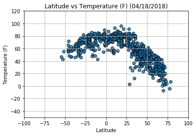
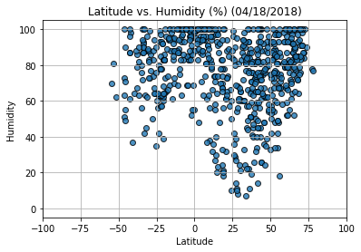
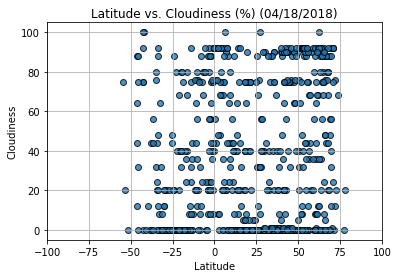
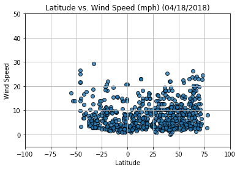

# Analysis
- Observed Trend 1 - The latitude vs. temperature plot shows that the highest temperatures are indeed closest to the equator.  Currently, the southern hemisphere has higher temperatures than the northern hemisphere.  Almost no southern hemisphere temperatures are below 50 degrees farenheit. 
- Observed Trend 2 - The latitude vs. humidity plot shows that humidity increases near the equator. Within 8 to 10 degrees latitude from the equator, there are no city with humidity less than 60%. 
- Observed Trend 3 - I did not notice a strong relationship between latitude and cloudiness or wind speed.  Instead, it appears that there may be some sort of bias in citipy or openweathermapi towards cities in the northern hemisphere.  Bias may not be the correct word, but if the random number generator picked completely random numbers, more southern hemisphere cities were filtered out by citipy or openweathermapi.  This could be because there are fewer weathermapi registered southern hemisphere or because the registered cities are further from the random coordinates that were randomly selected and northern hemisphere cities were picked instead.


```python
import matplotlib.pyplot as plt
import openweathermapy as ow
import pandas as pd
from citipy import citipy
from pprint import pprint
from random import random
import numpy as np
import requests
import datetime
from config import api_key
```

# Generate Cities List


```python
cities = []

for x in range(0,2000):
    ran_lat = np.random.uniform(-90,90)
    ran_lng = np.random.uniform(-180,180)
    
    city = citipy.nearest_city(ran_lat,ran_lng)

    name = city.city_name
    if name not in cities:
        cities.append(name)
        
len(cities)
```


    744


# Perform API Calls


```python
url = "http://api.openweathermap.org/data/2.5/weather?"
units = "imperial"

query_url = f"{url}appid={api_key}&units={units}&q="

shortened_city_list = []
temperature = []
humidity = []
latitude = []
longitude = []
cloudiness = []
wind_speed = []
count = 1

for city in cities:
    city_with_plus = city.replace(" ","+")
    print(city_with_plus)
    response = requests.get(query_url + city_with_plus).json()
    if response['cod'] != "404":
        shortened_city_list.append(city)
        temperature.append(response["main"]["temp"])
        humidity.append(response["main"]["humidity"])
        latitude.append(response["coord"]["lat"])
        longitude.append(response["coord"]["lon"])
        cloudiness.append(response["clouds"]["all"])
        wind_speed.append(response["wind"]["speed"])
        print("Processing Record " + str(count) + " " + city + " " + query_url + city_with_plus)
        count = count + 1
```

    tarko-sale
    Processing Record 1 tarko-sale http://api.openweathermap.org/data/2.5/weather?appid=5bf423bd383fb0cb5155fc161cbe794f&units=imperial&q=tarko-sale
    chapais
    Processing Record 2 chapais http://api.openweathermap.org/data/2.5/weather?appid=5bf423bd383fb0cb5155fc161cbe794f&units=imperial&q=chapais
    pozo+colorado
    Processing Record 3 pozo colorado http://api.openweathermap.org/data/2.5/weather?appid=5bf423bd383fb0cb5155fc161cbe794f&units=imperial&q=pozo+colorado
    nicoya
    Processing Record 4 nicoya http://api.openweathermap.org/data/2.5/weather?appid=5bf423bd383fb0cb5155fc161cbe794f&units=imperial&q=nicoya
    avarua
    Processing Record 5 avarua http://api.openweathermap.org/data/2.5/weather?appid=5bf423bd383fb0cb5155fc161cbe794f&units=imperial&q=avarua
    svetlaya
    Processing Record 6 svetlaya http://api.openweathermap.org/data/2.5/weather?appid=5bf423bd383fb0cb5155fc161cbe794f&units=imperial&q=svetlaya
    somerset+east
    Processing Record 7 somerset east http://api.openweathermap.org/data/2.5/weather?appid=5bf423bd383fb0cb5155fc161cbe794f&units=imperial&q=somerset+east
    butaritari
    Processing Record 8 butaritari http://api.openweathermap.org/data/2.5/weather?appid=5bf423bd383fb0cb5155fc161cbe794f&units=imperial&q=butaritari
    olinda
    Processing Record 9 olinda http://api.openweathermap.org/data/2.5/weather?appid=5bf423bd383fb0cb5155fc161cbe794f&units=imperial&q=olinda
    taolanaro
    bredasdorp
    Processing Record 10 bredasdorp http://api.openweathermap.org/data/2.5/weather?appid=5bf423bd383fb0cb5155fc161cbe794f&units=imperial&q=bredasdorp
    cape+town
    Processing Record 11 cape town http://api.openweathermap.org/data/2.5/weather?appid=5bf423bd383fb0cb5155fc161cbe794f&units=imperial&q=cape+town
    kjollefjord
    Processing Record 12 kjollefjord http://api.openweathermap.org/data/2.5/weather?appid=5bf423bd383fb0cb5155fc161cbe794f&units=imperial&q=kjollefjord
    tuktoyaktuk
    Processing Record 13 tuktoyaktuk http://api.openweathermap.org/data/2.5/weather?appid=5bf423bd383fb0cb5155fc161cbe794f&units=imperial&q=tuktoyaktuk
    busselton
    Processing Record 14 busselton http://api.openweathermap.org/data/2.5/weather?appid=5bf423bd383fb0cb5155fc161cbe794f&units=imperial&q=busselton
    forio
    Processing Record 15 forio http://api.openweathermap.org/data/2.5/weather?appid=5bf423bd383fb0cb5155fc161cbe794f&units=imperial&q=forio
    samarai
    Processing Record 16 samarai http://api.openweathermap.org/data/2.5/weather?appid=5bf423bd383fb0cb5155fc161cbe794f&units=imperial&q=samarai
    vaini
    Processing Record 17 vaini http://api.openweathermap.org/data/2.5/weather?appid=5bf423bd383fb0cb5155fc161cbe794f&units=imperial&q=vaini
    ponta+do+sol
    Processing Record 18 ponta do sol http://api.openweathermap.org/data/2.5/weather?appid=5bf423bd383fb0cb5155fc161cbe794f&units=imperial&q=ponta+do+sol
    port+hedland
    Processing Record 19 port hedland http://api.openweathermap.org/data/2.5/weather?appid=5bf423bd383fb0cb5155fc161cbe794f&units=imperial&q=port+hedland
    amderma
    atuona
    Processing Record 20 atuona http://api.openweathermap.org/data/2.5/weather?appid=5bf423bd383fb0cb5155fc161cbe794f&units=imperial&q=atuona
    chuy
    Processing Record 21 chuy http://api.openweathermap.org/data/2.5/weather?appid=5bf423bd383fb0cb5155fc161cbe794f&units=imperial&q=chuy
    jamestown
    Processing Record 22 jamestown http://api.openweathermap.org/data/2.5/weather?appid=5bf423bd383fb0cb5155fc161cbe794f&units=imperial&q=jamestown
    punta+arenas
    Processing Record 23 punta arenas http://api.openweathermap.org/data/2.5/weather?appid=5bf423bd383fb0cb5155fc161cbe794f&units=imperial&q=punta+arenas
    kapaa
    Processing Record 24 kapaa http://api.openweathermap.org/data/2.5/weather?appid=5bf423bd383fb0cb5155fc161cbe794f&units=imperial&q=kapaa
    iskateley
    Processing Record 25 iskateley http://api.openweathermap.org/data/2.5/weather?appid=5bf423bd383fb0cb5155fc161cbe794f&units=imperial&q=iskateley
    rikitea
    Processing Record 26 rikitea http://api.openweathermap.org/data/2.5/weather?appid=5bf423bd383fb0cb5155fc161cbe794f&units=imperial&q=rikitea
    illoqqortoormiut
    chokurdakh
    Processing Record 27 chokurdakh http://api.openweathermap.org/data/2.5/weather?appid=5bf423bd383fb0cb5155fc161cbe794f&units=imperial&q=chokurdakh
    klaksvik
    Processing Record 28 klaksvik http://api.openweathermap.org/data/2.5/weather?appid=5bf423bd383fb0cb5155fc161cbe794f&units=imperial&q=klaksvik
    amga
    Processing Record 29 amga http://api.openweathermap.org/data/2.5/weather?appid=5bf423bd383fb0cb5155fc161cbe794f&units=imperial&q=amga
    lasa
    Processing Record 30 lasa http://api.openweathermap.org/data/2.5/weather?appid=5bf423bd383fb0cb5155fc161cbe794f&units=imperial&q=lasa
    hermanus
    Processing Record 31 hermanus http://api.openweathermap.org/data/2.5/weather?appid=5bf423bd383fb0cb5155fc161cbe794f&units=imperial&q=hermanus
    tura
    Processing Record 32 tura http://api.openweathermap.org/data/2.5/weather?appid=5bf423bd383fb0cb5155fc161cbe794f&units=imperial&q=tura
    carnarvon
    Processing Record 33 carnarvon http://api.openweathermap.org/data/2.5/weather?appid=5bf423bd383fb0cb5155fc161cbe794f&units=imperial&q=carnarvon
    santo+antonio+do+ica
    Processing Record 34 santo antonio do ica http://api.openweathermap.org/data/2.5/weather?appid=5bf423bd383fb0cb5155fc161cbe794f&units=imperial&q=santo+antonio+do+ica
    namatanai
    Processing Record 35 namatanai http://api.openweathermap.org/data/2.5/weather?appid=5bf423bd383fb0cb5155fc161cbe794f&units=imperial&q=namatanai
    mahina
    Processing Record 36 mahina http://api.openweathermap.org/data/2.5/weather?appid=5bf423bd383fb0cb5155fc161cbe794f&units=imperial&q=mahina
    khatanga
    Processing Record 37 khatanga http://api.openweathermap.org/data/2.5/weather?appid=5bf423bd383fb0cb5155fc161cbe794f&units=imperial&q=khatanga
    abashiri
    Processing Record 38 abashiri http://api.openweathermap.org/data/2.5/weather?appid=5bf423bd383fb0cb5155fc161cbe794f&units=imperial&q=abashiri
    ushuaia
    Processing Record 39 ushuaia http://api.openweathermap.org/data/2.5/weather?appid=5bf423bd383fb0cb5155fc161cbe794f&units=imperial&q=ushuaia
    upata
    Processing Record 40 upata http://api.openweathermap.org/data/2.5/weather?appid=5bf423bd383fb0cb5155fc161cbe794f&units=imperial&q=upata
    hilo
    Processing Record 41 hilo http://api.openweathermap.org/data/2.5/weather?appid=5bf423bd383fb0cb5155fc161cbe794f&units=imperial&q=hilo
    hukuntsi
    Processing Record 42 hukuntsi http://api.openweathermap.org/data/2.5/weather?appid=5bf423bd383fb0cb5155fc161cbe794f&units=imperial&q=hukuntsi
    kamenskoye
    lata
    Processing Record 43 lata http://api.openweathermap.org/data/2.5/weather?appid=5bf423bd383fb0cb5155fc161cbe794f&units=imperial&q=lata
    baoqing
    Processing Record 44 baoqing http://api.openweathermap.org/data/2.5/weather?appid=5bf423bd383fb0cb5155fc161cbe794f&units=imperial&q=baoqing
    wajid
    Processing Record 45 wajid http://api.openweathermap.org/data/2.5/weather?appid=5bf423bd383fb0cb5155fc161cbe794f&units=imperial&q=wajid
    wulanhaote
    dingle
    Processing Record 46 dingle http://api.openweathermap.org/data/2.5/weather?appid=5bf423bd383fb0cb5155fc161cbe794f&units=imperial&q=dingle
    mahebourg
    Processing Record 47 mahebourg http://api.openweathermap.org/data/2.5/weather?appid=5bf423bd383fb0cb5155fc161cbe794f&units=imperial&q=mahebourg
    saint-philippe
    Processing Record 48 saint-philippe http://api.openweathermap.org/data/2.5/weather?appid=5bf423bd383fb0cb5155fc161cbe794f&units=imperial&q=saint-philippe
    thompson
    Processing Record 49 thompson http://api.openweathermap.org/data/2.5/weather?appid=5bf423bd383fb0cb5155fc161cbe794f&units=imperial&q=thompson
    husavik
    Processing Record 50 husavik http://api.openweathermap.org/data/2.5/weather?appid=5bf423bd383fb0cb5155fc161cbe794f&units=imperial&q=husavik
    claudio
    Processing Record 51 claudio http://api.openweathermap.org/data/2.5/weather?appid=5bf423bd383fb0cb5155fc161cbe794f&units=imperial&q=claudio
    mataura
    Processing Record 52 mataura http://api.openweathermap.org/data/2.5/weather?appid=5bf423bd383fb0cb5155fc161cbe794f&units=imperial&q=mataura
    grand+river+south+east
    portland
    Processing Record 53 portland http://api.openweathermap.org/data/2.5/weather?appid=5bf423bd383fb0cb5155fc161cbe794f&units=imperial&q=portland
    esperance
    Processing Record 54 esperance http://api.openweathermap.org/data/2.5/weather?appid=5bf423bd383fb0cb5155fc161cbe794f&units=imperial&q=esperance
    santa+maria
    Processing Record 55 santa maria http://api.openweathermap.org/data/2.5/weather?appid=5bf423bd383fb0cb5155fc161cbe794f&units=imperial&q=santa+maria
    torbay
    Processing Record 56 torbay http://api.openweathermap.org/data/2.5/weather?appid=5bf423bd383fb0cb5155fc161cbe794f&units=imperial&q=torbay
    rio+gallegos
    Processing Record 57 rio gallegos http://api.openweathermap.org/data/2.5/weather?appid=5bf423bd383fb0cb5155fc161cbe794f&units=imperial&q=rio+gallegos
    pacific+grove
    Processing Record 58 pacific grove http://api.openweathermap.org/data/2.5/weather?appid=5bf423bd383fb0cb5155fc161cbe794f&units=imperial&q=pacific+grove
    bandarbeyla
    Processing Record 59 bandarbeyla http://api.openweathermap.org/data/2.5/weather?appid=5bf423bd383fb0cb5155fc161cbe794f&units=imperial&q=bandarbeyla
    maniitsoq
    Processing Record 60 maniitsoq http://api.openweathermap.org/data/2.5/weather?appid=5bf423bd383fb0cb5155fc161cbe794f&units=imperial&q=maniitsoq
    port+alfred
    Processing Record 61 port alfred http://api.openweathermap.org/data/2.5/weather?appid=5bf423bd383fb0cb5155fc161cbe794f&units=imperial&q=port+alfred
    aqtobe
    Processing Record 62 aqtobe http://api.openweathermap.org/data/2.5/weather?appid=5bf423bd383fb0cb5155fc161cbe794f&units=imperial&q=aqtobe
    mulchen
    Processing Record 63 mulchen http://api.openweathermap.org/data/2.5/weather?appid=5bf423bd383fb0cb5155fc161cbe794f&units=imperial&q=mulchen
    albany
    Processing Record 64 albany http://api.openweathermap.org/data/2.5/weather?appid=5bf423bd383fb0cb5155fc161cbe794f&units=imperial&q=albany
    sosnovo-ozerskoye
    Processing Record 65 sosnovo-ozerskoye http://api.openweathermap.org/data/2.5/weather?appid=5bf423bd383fb0cb5155fc161cbe794f&units=imperial&q=sosnovo-ozerskoye
    nizhneyansk
    codrington
    Processing Record 66 codrington http://api.openweathermap.org/data/2.5/weather?appid=5bf423bd383fb0cb5155fc161cbe794f&units=imperial&q=codrington
    geraldton
    Processing Record 67 geraldton http://api.openweathermap.org/data/2.5/weather?appid=5bf423bd383fb0cb5155fc161cbe794f&units=imperial&q=geraldton
    komsomolskiy
    Processing Record 68 komsomolskiy http://api.openweathermap.org/data/2.5/weather?appid=5bf423bd383fb0cb5155fc161cbe794f&units=imperial&q=komsomolskiy
    faanui
    Processing Record 69 faanui http://api.openweathermap.org/data/2.5/weather?appid=5bf423bd383fb0cb5155fc161cbe794f&units=imperial&q=faanui
    saint+george
    Processing Record 70 saint george http://api.openweathermap.org/data/2.5/weather?appid=5bf423bd383fb0cb5155fc161cbe794f&units=imperial&q=saint+george
    rincon
    Processing Record 71 rincon http://api.openweathermap.org/data/2.5/weather?appid=5bf423bd383fb0cb5155fc161cbe794f&units=imperial&q=rincon
    arraial+do+cabo
    Processing Record 72 arraial do cabo http://api.openweathermap.org/data/2.5/weather?appid=5bf423bd383fb0cb5155fc161cbe794f&units=imperial&q=arraial+do+cabo
    saskylakh
    Processing Record 73 saskylakh http://api.openweathermap.org/data/2.5/weather?appid=5bf423bd383fb0cb5155fc161cbe794f&units=imperial&q=saskylakh
    grand+gaube
    Processing Record 74 grand gaube http://api.openweathermap.org/data/2.5/weather?appid=5bf423bd383fb0cb5155fc161cbe794f&units=imperial&q=grand+gaube
    port+lincoln
    Processing Record 75 port lincoln http://api.openweathermap.org/data/2.5/weather?appid=5bf423bd383fb0cb5155fc161cbe794f&units=imperial&q=port+lincoln
    sao+joao+da+barra
    Processing Record 76 sao joao da barra http://api.openweathermap.org/data/2.5/weather?appid=5bf423bd383fb0cb5155fc161cbe794f&units=imperial&q=sao+joao+da+barra
    nyagan
    Processing Record 77 nyagan http://api.openweathermap.org/data/2.5/weather?appid=5bf423bd383fb0cb5155fc161cbe794f&units=imperial&q=nyagan
    umzimvubu
    port+elizabeth
    Processing Record 78 port elizabeth http://api.openweathermap.org/data/2.5/weather?appid=5bf423bd383fb0cb5155fc161cbe794f&units=imperial&q=port+elizabeth
    constitucion
    Processing Record 79 constitucion http://api.openweathermap.org/data/2.5/weather?appid=5bf423bd383fb0cb5155fc161cbe794f&units=imperial&q=constitucion
    nabire
    Processing Record 80 nabire http://api.openweathermap.org/data/2.5/weather?appid=5bf423bd383fb0cb5155fc161cbe794f&units=imperial&q=nabire
    grindavik
    Processing Record 81 grindavik http://api.openweathermap.org/data/2.5/weather?appid=5bf423bd383fb0cb5155fc161cbe794f&units=imperial&q=grindavik
    goderich
    Processing Record 82 goderich http://api.openweathermap.org/data/2.5/weather?appid=5bf423bd383fb0cb5155fc161cbe794f&units=imperial&q=goderich
    la+seyne-sur-mer
    Processing Record 83 la seyne-sur-mer http://api.openweathermap.org/data/2.5/weather?appid=5bf423bd383fb0cb5155fc161cbe794f&units=imperial&q=la+seyne-sur-mer
    wote
    Processing Record 84 wote http://api.openweathermap.org/data/2.5/weather?appid=5bf423bd383fb0cb5155fc161cbe794f&units=imperial&q=wote
    samusu
    hobart
    Processing Record 85 hobart http://api.openweathermap.org/data/2.5/weather?appid=5bf423bd383fb0cb5155fc161cbe794f&units=imperial&q=hobart
    cierna+nad+tisou
    Processing Record 86 cierna nad tisou http://api.openweathermap.org/data/2.5/weather?appid=5bf423bd383fb0cb5155fc161cbe794f&units=imperial&q=cierna+nad+tisou
    bluff
    Processing Record 87 bluff http://api.openweathermap.org/data/2.5/weather?appid=5bf423bd383fb0cb5155fc161cbe794f&units=imperial&q=bluff
    cap-aux-meules
    Processing Record 88 cap-aux-meules http://api.openweathermap.org/data/2.5/weather?appid=5bf423bd383fb0cb5155fc161cbe794f&units=imperial&q=cap-aux-meules
    marcona
    coro
    Processing Record 89 coro http://api.openweathermap.org/data/2.5/weather?appid=5bf423bd383fb0cb5155fc161cbe794f&units=imperial&q=coro
    mount+gambier
    Processing Record 90 mount gambier http://api.openweathermap.org/data/2.5/weather?appid=5bf423bd383fb0cb5155fc161cbe794f&units=imperial&q=mount+gambier
    goure
    Processing Record 91 goure http://api.openweathermap.org/data/2.5/weather?appid=5bf423bd383fb0cb5155fc161cbe794f&units=imperial&q=goure
    nouadhibou
    Processing Record 92 nouadhibou http://api.openweathermap.org/data/2.5/weather?appid=5bf423bd383fb0cb5155fc161cbe794f&units=imperial&q=nouadhibou
    west+helena
    Processing Record 93 west helena http://api.openweathermap.org/data/2.5/weather?appid=5bf423bd383fb0cb5155fc161cbe794f&units=imperial&q=west+helena
    broome
    Processing Record 94 broome http://api.openweathermap.org/data/2.5/weather?appid=5bf423bd383fb0cb5155fc161cbe794f&units=imperial&q=broome
    itacare
    Processing Record 95 itacare http://api.openweathermap.org/data/2.5/weather?appid=5bf423bd383fb0cb5155fc161cbe794f&units=imperial&q=itacare
    hohhot
    Processing Record 96 hohhot http://api.openweathermap.org/data/2.5/weather?appid=5bf423bd383fb0cb5155fc161cbe794f&units=imperial&q=hohhot
    charters+towers
    Processing Record 97 charters towers http://api.openweathermap.org/data/2.5/weather?appid=5bf423bd383fb0cb5155fc161cbe794f&units=imperial&q=charters+towers
    meteti
    Processing Record 98 meteti http://api.openweathermap.org/data/2.5/weather?appid=5bf423bd383fb0cb5155fc161cbe794f&units=imperial&q=meteti
    kavaratti
    Processing Record 99 kavaratti http://api.openweathermap.org/data/2.5/weather?appid=5bf423bd383fb0cb5155fc161cbe794f&units=imperial&q=kavaratti
    guerrero+negro
    Processing Record 100 guerrero negro http://api.openweathermap.org/data/2.5/weather?appid=5bf423bd383fb0cb5155fc161cbe794f&units=imperial&q=guerrero+negro
    santiago+del+estero
    Processing Record 101 santiago del estero http://api.openweathermap.org/data/2.5/weather?appid=5bf423bd383fb0cb5155fc161cbe794f&units=imperial&q=santiago+del+estero
    seydi
    Processing Record 102 seydi http://api.openweathermap.org/data/2.5/weather?appid=5bf423bd383fb0cb5155fc161cbe794f&units=imperial&q=seydi
    dzaoudzi
    Processing Record 103 dzaoudzi http://api.openweathermap.org/data/2.5/weather?appid=5bf423bd383fb0cb5155fc161cbe794f&units=imperial&q=dzaoudzi
    los+llanos+de+aridane
    Processing Record 104 los llanos de aridane http://api.openweathermap.org/data/2.5/weather?appid=5bf423bd383fb0cb5155fc161cbe794f&units=imperial&q=los+llanos+de+aridane
    severo-kurilsk
    Processing Record 105 severo-kurilsk http://api.openweathermap.org/data/2.5/weather?appid=5bf423bd383fb0cb5155fc161cbe794f&units=imperial&q=severo-kurilsk
    sorvag
    tafresh
    Processing Record 106 tafresh http://api.openweathermap.org/data/2.5/weather?appid=5bf423bd383fb0cb5155fc161cbe794f&units=imperial&q=tafresh
    khandyga
    Processing Record 107 khandyga http://api.openweathermap.org/data/2.5/weather?appid=5bf423bd383fb0cb5155fc161cbe794f&units=imperial&q=khandyga
    nikolskoye
    Processing Record 108 nikolskoye http://api.openweathermap.org/data/2.5/weather?appid=5bf423bd383fb0cb5155fc161cbe794f&units=imperial&q=nikolskoye
    dikson
    Processing Record 109 dikson http://api.openweathermap.org/data/2.5/weather?appid=5bf423bd383fb0cb5155fc161cbe794f&units=imperial&q=dikson
    evensk
    Processing Record 110 evensk http://api.openweathermap.org/data/2.5/weather?appid=5bf423bd383fb0cb5155fc161cbe794f&units=imperial&q=evensk
    ornskoldsvik
    Processing Record 111 ornskoldsvik http://api.openweathermap.org/data/2.5/weather?appid=5bf423bd383fb0cb5155fc161cbe794f&units=imperial&q=ornskoldsvik
    solsvik
    ketchikan
    Processing Record 112 ketchikan http://api.openweathermap.org/data/2.5/weather?appid=5bf423bd383fb0cb5155fc161cbe794f&units=imperial&q=ketchikan
    samalaeulu
    georgetown
    Processing Record 113 georgetown http://api.openweathermap.org/data/2.5/weather?appid=5bf423bd383fb0cb5155fc161cbe794f&units=imperial&q=georgetown
    palembang
    Processing Record 114 palembang http://api.openweathermap.org/data/2.5/weather?appid=5bf423bd383fb0cb5155fc161cbe794f&units=imperial&q=palembang
    karakendzha
    cockburn+town
    Processing Record 115 cockburn town http://api.openweathermap.org/data/2.5/weather?appid=5bf423bd383fb0cb5155fc161cbe794f&units=imperial&q=cockburn+town
    new+norfolk
    Processing Record 116 new norfolk http://api.openweathermap.org/data/2.5/weather?appid=5bf423bd383fb0cb5155fc161cbe794f&units=imperial&q=new+norfolk
    salisbury
    Processing Record 117 salisbury http://api.openweathermap.org/data/2.5/weather?appid=5bf423bd383fb0cb5155fc161cbe794f&units=imperial&q=salisbury
    tokur
    Processing Record 118 tokur http://api.openweathermap.org/data/2.5/weather?appid=5bf423bd383fb0cb5155fc161cbe794f&units=imperial&q=tokur
    karasjok
    Processing Record 119 karasjok http://api.openweathermap.org/data/2.5/weather?appid=5bf423bd383fb0cb5155fc161cbe794f&units=imperial&q=karasjok
    hithadhoo
    Processing Record 120 hithadhoo http://api.openweathermap.org/data/2.5/weather?appid=5bf423bd383fb0cb5155fc161cbe794f&units=imperial&q=hithadhoo
    coihaique
    Processing Record 121 coihaique http://api.openweathermap.org/data/2.5/weather?appid=5bf423bd383fb0cb5155fc161cbe794f&units=imperial&q=coihaique
    merauke
    Processing Record 122 merauke http://api.openweathermap.org/data/2.5/weather?appid=5bf423bd383fb0cb5155fc161cbe794f&units=imperial&q=merauke
    ancud
    Processing Record 123 ancud http://api.openweathermap.org/data/2.5/weather?appid=5bf423bd383fb0cb5155fc161cbe794f&units=imperial&q=ancud
    alofi
    Processing Record 124 alofi http://api.openweathermap.org/data/2.5/weather?appid=5bf423bd383fb0cb5155fc161cbe794f&units=imperial&q=alofi
    arandis
    Processing Record 125 arandis http://api.openweathermap.org/data/2.5/weather?appid=5bf423bd383fb0cb5155fc161cbe794f&units=imperial&q=arandis
    victoria
    Processing Record 126 victoria http://api.openweathermap.org/data/2.5/weather?appid=5bf423bd383fb0cb5155fc161cbe794f&units=imperial&q=victoria
    qaanaaq
    Processing Record 127 qaanaaq http://api.openweathermap.org/data/2.5/weather?appid=5bf423bd383fb0cb5155fc161cbe794f&units=imperial&q=qaanaaq
    gubkinskiy
    Processing Record 128 gubkinskiy http://api.openweathermap.org/data/2.5/weather?appid=5bf423bd383fb0cb5155fc161cbe794f&units=imperial&q=gubkinskiy
    bida
    Processing Record 129 bida http://api.openweathermap.org/data/2.5/weather?appid=5bf423bd383fb0cb5155fc161cbe794f&units=imperial&q=bida
    cayenne
    Processing Record 130 cayenne http://api.openweathermap.org/data/2.5/weather?appid=5bf423bd383fb0cb5155fc161cbe794f&units=imperial&q=cayenne
    cidreira
    Processing Record 131 cidreira http://api.openweathermap.org/data/2.5/weather?appid=5bf423bd383fb0cb5155fc161cbe794f&units=imperial&q=cidreira
    boa+vista
    Processing Record 132 boa vista http://api.openweathermap.org/data/2.5/weather?appid=5bf423bd383fb0cb5155fc161cbe794f&units=imperial&q=boa+vista
    tazovskiy
    Processing Record 133 tazovskiy http://api.openweathermap.org/data/2.5/weather?appid=5bf423bd383fb0cb5155fc161cbe794f&units=imperial&q=tazovskiy
    matara
    Processing Record 134 matara http://api.openweathermap.org/data/2.5/weather?appid=5bf423bd383fb0cb5155fc161cbe794f&units=imperial&q=matara
    east+london
    Processing Record 135 east london http://api.openweathermap.org/data/2.5/weather?appid=5bf423bd383fb0cb5155fc161cbe794f&units=imperial&q=east+london
    port-gentil
    Processing Record 136 port-gentil http://api.openweathermap.org/data/2.5/weather?appid=5bf423bd383fb0cb5155fc161cbe794f&units=imperial&q=port-gentil
    bongaree
    Processing Record 137 bongaree http://api.openweathermap.org/data/2.5/weather?appid=5bf423bd383fb0cb5155fc161cbe794f&units=imperial&q=bongaree
    souillac
    Processing Record 138 souillac http://api.openweathermap.org/data/2.5/weather?appid=5bf423bd383fb0cb5155fc161cbe794f&units=imperial&q=souillac
    poum
    Processing Record 139 poum http://api.openweathermap.org/data/2.5/weather?appid=5bf423bd383fb0cb5155fc161cbe794f&units=imperial&q=poum
    bengkulu
    yumen
    Processing Record 140 yumen http://api.openweathermap.org/data/2.5/weather?appid=5bf423bd383fb0cb5155fc161cbe794f&units=imperial&q=yumen
    pedernales
    Processing Record 141 pedernales http://api.openweathermap.org/data/2.5/weather?appid=5bf423bd383fb0cb5155fc161cbe794f&units=imperial&q=pedernales
    attawapiskat
    te+anau
    Processing Record 142 te anau http://api.openweathermap.org/data/2.5/weather?appid=5bf423bd383fb0cb5155fc161cbe794f&units=imperial&q=te+anau
    nishihara
    Processing Record 143 nishihara http://api.openweathermap.org/data/2.5/weather?appid=5bf423bd383fb0cb5155fc161cbe794f&units=imperial&q=nishihara
    ostrovnoy
    Processing Record 144 ostrovnoy http://api.openweathermap.org/data/2.5/weather?appid=5bf423bd383fb0cb5155fc161cbe794f&units=imperial&q=ostrovnoy
    saleaula
    maceio
    Processing Record 145 maceio http://api.openweathermap.org/data/2.5/weather?appid=5bf423bd383fb0cb5155fc161cbe794f&units=imperial&q=maceio
    nguiu
    bethel
    Processing Record 146 bethel http://api.openweathermap.org/data/2.5/weather?appid=5bf423bd383fb0cb5155fc161cbe794f&units=imperial&q=bethel
    port+keats
    Processing Record 147 port keats http://api.openweathermap.org/data/2.5/weather?appid=5bf423bd383fb0cb5155fc161cbe794f&units=imperial&q=port+keats
    bambous+virieux
    Processing Record 148 bambous virieux http://api.openweathermap.org/data/2.5/weather?appid=5bf423bd383fb0cb5155fc161cbe794f&units=imperial&q=bambous+virieux
    moravska+trebova
    Processing Record 149 moravska trebova http://api.openweathermap.org/data/2.5/weather?appid=5bf423bd383fb0cb5155fc161cbe794f&units=imperial&q=moravska+trebova
    vila+velha
    Processing Record 150 vila velha http://api.openweathermap.org/data/2.5/weather?appid=5bf423bd383fb0cb5155fc161cbe794f&units=imperial&q=vila+velha
    half+moon+bay
    Processing Record 151 half moon bay http://api.openweathermap.org/data/2.5/weather?appid=5bf423bd383fb0cb5155fc161cbe794f&units=imperial&q=half+moon+bay
    bilibino
    Processing Record 152 bilibino http://api.openweathermap.org/data/2.5/weather?appid=5bf423bd383fb0cb5155fc161cbe794f&units=imperial&q=bilibino
    luderitz
    Processing Record 153 luderitz http://api.openweathermap.org/data/2.5/weather?appid=5bf423bd383fb0cb5155fc161cbe794f&units=imperial&q=luderitz
    deputatskiy
    Processing Record 154 deputatskiy http://api.openweathermap.org/data/2.5/weather?appid=5bf423bd383fb0cb5155fc161cbe794f&units=imperial&q=deputatskiy
    pisco
    Processing Record 155 pisco http://api.openweathermap.org/data/2.5/weather?appid=5bf423bd383fb0cb5155fc161cbe794f&units=imperial&q=pisco
    tasiilaq
    Processing Record 156 tasiilaq http://api.openweathermap.org/data/2.5/weather?appid=5bf423bd383fb0cb5155fc161cbe794f&units=imperial&q=tasiilaq
    alekseyevsk
    Processing Record 157 alekseyevsk http://api.openweathermap.org/data/2.5/weather?appid=5bf423bd383fb0cb5155fc161cbe794f&units=imperial&q=alekseyevsk
    jumla
    Processing Record 158 jumla http://api.openweathermap.org/data/2.5/weather?appid=5bf423bd383fb0cb5155fc161cbe794f&units=imperial&q=jumla
    paita
    Processing Record 159 paita http://api.openweathermap.org/data/2.5/weather?appid=5bf423bd383fb0cb5155fc161cbe794f&units=imperial&q=paita
    ribeira+grande
    Processing Record 160 ribeira grande http://api.openweathermap.org/data/2.5/weather?appid=5bf423bd383fb0cb5155fc161cbe794f&units=imperial&q=ribeira+grande
    kirakira
    Processing Record 161 kirakira http://api.openweathermap.org/data/2.5/weather?appid=5bf423bd383fb0cb5155fc161cbe794f&units=imperial&q=kirakira
    beringovskiy
    Processing Record 162 beringovskiy http://api.openweathermap.org/data/2.5/weather?appid=5bf423bd383fb0cb5155fc161cbe794f&units=imperial&q=beringovskiy
    paamiut
    Processing Record 163 paamiut http://api.openweathermap.org/data/2.5/weather?appid=5bf423bd383fb0cb5155fc161cbe794f&units=imperial&q=paamiut
    barranca
    Processing Record 164 barranca http://api.openweathermap.org/data/2.5/weather?appid=5bf423bd383fb0cb5155fc161cbe794f&units=imperial&q=barranca
    ola
    Processing Record 165 ola http://api.openweathermap.org/data/2.5/weather?appid=5bf423bd383fb0cb5155fc161cbe794f&units=imperial&q=ola
    provideniya
    Processing Record 166 provideniya http://api.openweathermap.org/data/2.5/weather?appid=5bf423bd383fb0cb5155fc161cbe794f&units=imperial&q=provideniya
    saint-francois
    Processing Record 167 saint-francois http://api.openweathermap.org/data/2.5/weather?appid=5bf423bd383fb0cb5155fc161cbe794f&units=imperial&q=saint-francois
    atar
    Processing Record 168 atar http://api.openweathermap.org/data/2.5/weather?appid=5bf423bd383fb0cb5155fc161cbe794f&units=imperial&q=atar
    sungairaya
    Processing Record 169 sungairaya http://api.openweathermap.org/data/2.5/weather?appid=5bf423bd383fb0cb5155fc161cbe794f&units=imperial&q=sungairaya
    marsa+matruh
    Processing Record 170 marsa matruh http://api.openweathermap.org/data/2.5/weather?appid=5bf423bd383fb0cb5155fc161cbe794f&units=imperial&q=marsa+matruh
    tadine
    Processing Record 171 tadine http://api.openweathermap.org/data/2.5/weather?appid=5bf423bd383fb0cb5155fc161cbe794f&units=imperial&q=tadine
    el+alto
    Processing Record 172 el alto http://api.openweathermap.org/data/2.5/weather?appid=5bf423bd383fb0cb5155fc161cbe794f&units=imperial&q=el+alto
    drezdenko
    Processing Record 173 drezdenko http://api.openweathermap.org/data/2.5/weather?appid=5bf423bd383fb0cb5155fc161cbe794f&units=imperial&q=drezdenko
    seoul
    Processing Record 174 seoul http://api.openweathermap.org/data/2.5/weather?appid=5bf423bd383fb0cb5155fc161cbe794f&units=imperial&q=seoul
    tongling
    Processing Record 175 tongling http://api.openweathermap.org/data/2.5/weather?appid=5bf423bd383fb0cb5155fc161cbe794f&units=imperial&q=tongling
    makat
    Processing Record 176 makat http://api.openweathermap.org/data/2.5/weather?appid=5bf423bd383fb0cb5155fc161cbe794f&units=imperial&q=makat
    morgan+city
    Processing Record 177 morgan city http://api.openweathermap.org/data/2.5/weather?appid=5bf423bd383fb0cb5155fc161cbe794f&units=imperial&q=morgan+city
    flinders
    Processing Record 178 flinders http://api.openweathermap.org/data/2.5/weather?appid=5bf423bd383fb0cb5155fc161cbe794f&units=imperial&q=flinders
    hendaye
    Processing Record 179 hendaye http://api.openweathermap.org/data/2.5/weather?appid=5bf423bd383fb0cb5155fc161cbe794f&units=imperial&q=hendaye
    nantucket
    Processing Record 180 nantucket http://api.openweathermap.org/data/2.5/weather?appid=5bf423bd383fb0cb5155fc161cbe794f&units=imperial&q=nantucket
    chernyshevskiy
    Processing Record 181 chernyshevskiy http://api.openweathermap.org/data/2.5/weather?appid=5bf423bd383fb0cb5155fc161cbe794f&units=imperial&q=chernyshevskiy
    jinchang
    Processing Record 182 jinchang http://api.openweathermap.org/data/2.5/weather?appid=5bf423bd383fb0cb5155fc161cbe794f&units=imperial&q=jinchang
    sentyabrskiy
    iqaluit
    Processing Record 183 iqaluit http://api.openweathermap.org/data/2.5/weather?appid=5bf423bd383fb0cb5155fc161cbe794f&units=imperial&q=iqaluit
    fortuna
    Processing Record 184 fortuna http://api.openweathermap.org/data/2.5/weather?appid=5bf423bd383fb0cb5155fc161cbe794f&units=imperial&q=fortuna
    nanortalik
    Processing Record 185 nanortalik http://api.openweathermap.org/data/2.5/weather?appid=5bf423bd383fb0cb5155fc161cbe794f&units=imperial&q=nanortalik
    yeppoon
    Processing Record 186 yeppoon http://api.openweathermap.org/data/2.5/weather?appid=5bf423bd383fb0cb5155fc161cbe794f&units=imperial&q=yeppoon
    causapscal
    Processing Record 187 causapscal http://api.openweathermap.org/data/2.5/weather?appid=5bf423bd383fb0cb5155fc161cbe794f&units=imperial&q=causapscal
    norman+wells
    Processing Record 188 norman wells http://api.openweathermap.org/data/2.5/weather?appid=5bf423bd383fb0cb5155fc161cbe794f&units=imperial&q=norman+wells
    balaipungut
    Processing Record 189 balaipungut http://api.openweathermap.org/data/2.5/weather?appid=5bf423bd383fb0cb5155fc161cbe794f&units=imperial&q=balaipungut
    juneau
    Processing Record 190 juneau http://api.openweathermap.org/data/2.5/weather?appid=5bf423bd383fb0cb5155fc161cbe794f&units=imperial&q=juneau
    san+jose
    Processing Record 191 san jose http://api.openweathermap.org/data/2.5/weather?appid=5bf423bd383fb0cb5155fc161cbe794f&units=imperial&q=san+jose
    kieta
    Processing Record 192 kieta http://api.openweathermap.org/data/2.5/weather?appid=5bf423bd383fb0cb5155fc161cbe794f&units=imperial&q=kieta
    aloleng
    Processing Record 193 aloleng http://api.openweathermap.org/data/2.5/weather?appid=5bf423bd383fb0cb5155fc161cbe794f&units=imperial&q=aloleng
    kaseda
    Processing Record 194 kaseda http://api.openweathermap.org/data/2.5/weather?appid=5bf423bd383fb0cb5155fc161cbe794f&units=imperial&q=kaseda
    sao+gabriel+da+cachoeira
    Processing Record 195 sao gabriel da cachoeira http://api.openweathermap.org/data/2.5/weather?appid=5bf423bd383fb0cb5155fc161cbe794f&units=imperial&q=sao+gabriel+da+cachoeira
    yar-sale
    Processing Record 196 yar-sale http://api.openweathermap.org/data/2.5/weather?appid=5bf423bd383fb0cb5155fc161cbe794f&units=imperial&q=yar-sale
    kuche
    barentsburg
    kamenka
    Processing Record 197 kamenka http://api.openweathermap.org/data/2.5/weather?appid=5bf423bd383fb0cb5155fc161cbe794f&units=imperial&q=kamenka
    pedro+juan+caballero
    Processing Record 198 pedro juan caballero http://api.openweathermap.org/data/2.5/weather?appid=5bf423bd383fb0cb5155fc161cbe794f&units=imperial&q=pedro+juan+caballero
    richards+bay
    Processing Record 199 richards bay http://api.openweathermap.org/data/2.5/weather?appid=5bf423bd383fb0cb5155fc161cbe794f&units=imperial&q=richards+bay
    haines+junction
    Processing Record 200 haines junction http://api.openweathermap.org/data/2.5/weather?appid=5bf423bd383fb0cb5155fc161cbe794f&units=imperial&q=haines+junction
    bac+lieu
    lompoc
    Processing Record 201 lompoc http://api.openweathermap.org/data/2.5/weather?appid=5bf423bd383fb0cb5155fc161cbe794f&units=imperial&q=lompoc
    puerto+ayora
    Processing Record 202 puerto ayora http://api.openweathermap.org/data/2.5/weather?appid=5bf423bd383fb0cb5155fc161cbe794f&units=imperial&q=puerto+ayora
    lakes+entrance
    Processing Record 203 lakes entrance http://api.openweathermap.org/data/2.5/weather?appid=5bf423bd383fb0cb5155fc161cbe794f&units=imperial&q=lakes+entrance
    swan+river
    Processing Record 204 swan river http://api.openweathermap.org/data/2.5/weather?appid=5bf423bd383fb0cb5155fc161cbe794f&units=imperial&q=swan+river
    concarneau
    Processing Record 205 concarneau http://api.openweathermap.org/data/2.5/weather?appid=5bf423bd383fb0cb5155fc161cbe794f&units=imperial&q=concarneau
    bealanana
    Processing Record 206 bealanana http://api.openweathermap.org/data/2.5/weather?appid=5bf423bd383fb0cb5155fc161cbe794f&units=imperial&q=bealanana
    oistins
    Processing Record 207 oistins http://api.openweathermap.org/data/2.5/weather?appid=5bf423bd383fb0cb5155fc161cbe794f&units=imperial&q=oistins
    port+hardy
    Processing Record 208 port hardy http://api.openweathermap.org/data/2.5/weather?appid=5bf423bd383fb0cb5155fc161cbe794f&units=imperial&q=port+hardy
    wamba
    Processing Record 209 wamba http://api.openweathermap.org/data/2.5/weather?appid=5bf423bd383fb0cb5155fc161cbe794f&units=imperial&q=wamba
    adrar
    Processing Record 210 adrar http://api.openweathermap.org/data/2.5/weather?appid=5bf423bd383fb0cb5155fc161cbe794f&units=imperial&q=adrar
    dunedin
    Processing Record 211 dunedin http://api.openweathermap.org/data/2.5/weather?appid=5bf423bd383fb0cb5155fc161cbe794f&units=imperial&q=dunedin
    vaitupu
    mar+del+plata
    Processing Record 212 mar del plata http://api.openweathermap.org/data/2.5/weather?appid=5bf423bd383fb0cb5155fc161cbe794f&units=imperial&q=mar+del+plata
    cabo+san+lucas
    Processing Record 213 cabo san lucas http://api.openweathermap.org/data/2.5/weather?appid=5bf423bd383fb0cb5155fc161cbe794f&units=imperial&q=cabo+san+lucas
    bur+gabo
    san+patricio
    Processing Record 214 san patricio http://api.openweathermap.org/data/2.5/weather?appid=5bf423bd383fb0cb5155fc161cbe794f&units=imperial&q=san+patricio
    gamba
    Processing Record 215 gamba http://api.openweathermap.org/data/2.5/weather?appid=5bf423bd383fb0cb5155fc161cbe794f&units=imperial&q=gamba
    emerald
    Processing Record 216 emerald http://api.openweathermap.org/data/2.5/weather?appid=5bf423bd383fb0cb5155fc161cbe794f&units=imperial&q=emerald
    saldanha
    Processing Record 217 saldanha http://api.openweathermap.org/data/2.5/weather?appid=5bf423bd383fb0cb5155fc161cbe794f&units=imperial&q=saldanha
    katsuura
    Processing Record 218 katsuura http://api.openweathermap.org/data/2.5/weather?appid=5bf423bd383fb0cb5155fc161cbe794f&units=imperial&q=katsuura
    meilu
    monterey
    Processing Record 219 monterey http://api.openweathermap.org/data/2.5/weather?appid=5bf423bd383fb0cb5155fc161cbe794f&units=imperial&q=monterey
    klyuchi
    Processing Record 220 klyuchi http://api.openweathermap.org/data/2.5/weather?appid=5bf423bd383fb0cb5155fc161cbe794f&units=imperial&q=klyuchi
    kupang
    Processing Record 221 kupang http://api.openweathermap.org/data/2.5/weather?appid=5bf423bd383fb0cb5155fc161cbe794f&units=imperial&q=kupang
    almeirim
    Processing Record 222 almeirim http://api.openweathermap.org/data/2.5/weather?appid=5bf423bd383fb0cb5155fc161cbe794f&units=imperial&q=almeirim
    kloulklubed
    Processing Record 223 kloulklubed http://api.openweathermap.org/data/2.5/weather?appid=5bf423bd383fb0cb5155fc161cbe794f&units=imperial&q=kloulklubed
    mys+shmidta
    kostomuksha
    Processing Record 224 kostomuksha http://api.openweathermap.org/data/2.5/weather?appid=5bf423bd383fb0cb5155fc161cbe794f&units=imperial&q=kostomuksha
    moranbah
    Processing Record 225 moranbah http://api.openweathermap.org/data/2.5/weather?appid=5bf423bd383fb0cb5155fc161cbe794f&units=imperial&q=moranbah
    barrow
    Processing Record 226 barrow http://api.openweathermap.org/data/2.5/weather?appid=5bf423bd383fb0cb5155fc161cbe794f&units=imperial&q=barrow
    kodiak
    Processing Record 227 kodiak http://api.openweathermap.org/data/2.5/weather?appid=5bf423bd383fb0cb5155fc161cbe794f&units=imperial&q=kodiak
    kaitangata
    Processing Record 228 kaitangata http://api.openweathermap.org/data/2.5/weather?appid=5bf423bd383fb0cb5155fc161cbe794f&units=imperial&q=kaitangata
    isiro
    Processing Record 229 isiro http://api.openweathermap.org/data/2.5/weather?appid=5bf423bd383fb0cb5155fc161cbe794f&units=imperial&q=isiro
    caucaia
    Processing Record 230 caucaia http://api.openweathermap.org/data/2.5/weather?appid=5bf423bd383fb0cb5155fc161cbe794f&units=imperial&q=caucaia
    castro
    Processing Record 231 castro http://api.openweathermap.org/data/2.5/weather?appid=5bf423bd383fb0cb5155fc161cbe794f&units=imperial&q=castro
    ossora
    Processing Record 232 ossora http://api.openweathermap.org/data/2.5/weather?appid=5bf423bd383fb0cb5155fc161cbe794f&units=imperial&q=ossora
    tautira
    Processing Record 233 tautira http://api.openweathermap.org/data/2.5/weather?appid=5bf423bd383fb0cb5155fc161cbe794f&units=imperial&q=tautira
    tiksi
    Processing Record 234 tiksi http://api.openweathermap.org/data/2.5/weather?appid=5bf423bd383fb0cb5155fc161cbe794f&units=imperial&q=tiksi
    lagoa
    Processing Record 235 lagoa http://api.openweathermap.org/data/2.5/weather?appid=5bf423bd383fb0cb5155fc161cbe794f&units=imperial&q=lagoa
    sao+filipe
    Processing Record 236 sao filipe http://api.openweathermap.org/data/2.5/weather?appid=5bf423bd383fb0cb5155fc161cbe794f&units=imperial&q=sao+filipe
    hamilton
    Processing Record 237 hamilton http://api.openweathermap.org/data/2.5/weather?appid=5bf423bd383fb0cb5155fc161cbe794f&units=imperial&q=hamilton
    rabak
    Processing Record 238 rabak http://api.openweathermap.org/data/2.5/weather?appid=5bf423bd383fb0cb5155fc161cbe794f&units=imperial&q=rabak
    lavrentiya
    Processing Record 239 lavrentiya http://api.openweathermap.org/data/2.5/weather?appid=5bf423bd383fb0cb5155fc161cbe794f&units=imperial&q=lavrentiya
    placido+de+castro
    Processing Record 240 placido de castro http://api.openweathermap.org/data/2.5/weather?appid=5bf423bd383fb0cb5155fc161cbe794f&units=imperial&q=placido+de+castro
    usinsk
    Processing Record 241 usinsk http://api.openweathermap.org/data/2.5/weather?appid=5bf423bd383fb0cb5155fc161cbe794f&units=imperial&q=usinsk
    jamnah
    rome
    Processing Record 242 rome http://api.openweathermap.org/data/2.5/weather?appid=5bf423bd383fb0cb5155fc161cbe794f&units=imperial&q=rome
    yafran
    Processing Record 243 yafran http://api.openweathermap.org/data/2.5/weather?appid=5bf423bd383fb0cb5155fc161cbe794f&units=imperial&q=yafran
    buchanan
    Processing Record 244 buchanan http://api.openweathermap.org/data/2.5/weather?appid=5bf423bd383fb0cb5155fc161cbe794f&units=imperial&q=buchanan
    capaci
    Processing Record 245 capaci http://api.openweathermap.org/data/2.5/weather?appid=5bf423bd383fb0cb5155fc161cbe794f&units=imperial&q=capaci
    upernavik
    Processing Record 246 upernavik http://api.openweathermap.org/data/2.5/weather?appid=5bf423bd383fb0cb5155fc161cbe794f&units=imperial&q=upernavik
    vao
    Processing Record 247 vao http://api.openweathermap.org/data/2.5/weather?appid=5bf423bd383fb0cb5155fc161cbe794f&units=imperial&q=vao
    nevers
    Processing Record 248 nevers http://api.openweathermap.org/data/2.5/weather?appid=5bf423bd383fb0cb5155fc161cbe794f&units=imperial&q=nevers
    dharur
    Processing Record 249 dharur http://api.openweathermap.org/data/2.5/weather?appid=5bf423bd383fb0cb5155fc161cbe794f&units=imperial&q=dharur
    vanino
    Processing Record 250 vanino http://api.openweathermap.org/data/2.5/weather?appid=5bf423bd383fb0cb5155fc161cbe794f&units=imperial&q=vanino
    hartford
    Processing Record 251 hartford http://api.openweathermap.org/data/2.5/weather?appid=5bf423bd383fb0cb5155fc161cbe794f&units=imperial&q=hartford
    airai
    Processing Record 252 airai http://api.openweathermap.org/data/2.5/weather?appid=5bf423bd383fb0cb5155fc161cbe794f&units=imperial&q=airai
    ahuimanu
    Processing Record 253 ahuimanu http://api.openweathermap.org/data/2.5/weather?appid=5bf423bd383fb0cb5155fc161cbe794f&units=imperial&q=ahuimanu
    berlevag
    Processing Record 254 berlevag http://api.openweathermap.org/data/2.5/weather?appid=5bf423bd383fb0cb5155fc161cbe794f&units=imperial&q=berlevag
    boralday
    Processing Record 255 boralday http://api.openweathermap.org/data/2.5/weather?appid=5bf423bd383fb0cb5155fc161cbe794f&units=imperial&q=boralday
    sola
    Processing Record 256 sola http://api.openweathermap.org/data/2.5/weather?appid=5bf423bd383fb0cb5155fc161cbe794f&units=imperial&q=sola
    vanimo
    Processing Record 257 vanimo http://api.openweathermap.org/data/2.5/weather?appid=5bf423bd383fb0cb5155fc161cbe794f&units=imperial&q=vanimo
    jega
    Processing Record 258 jega http://api.openweathermap.org/data/2.5/weather?appid=5bf423bd383fb0cb5155fc161cbe794f&units=imperial&q=jega
    arya
    yellowknife
    Processing Record 259 yellowknife http://api.openweathermap.org/data/2.5/weather?appid=5bf423bd383fb0cb5155fc161cbe794f&units=imperial&q=yellowknife
    bayanday
    Processing Record 260 bayanday http://api.openweathermap.org/data/2.5/weather?appid=5bf423bd383fb0cb5155fc161cbe794f&units=imperial&q=bayanday
    ambilobe
    Processing Record 261 ambilobe http://api.openweathermap.org/data/2.5/weather?appid=5bf423bd383fb0cb5155fc161cbe794f&units=imperial&q=ambilobe
    pevek
    Processing Record 262 pevek http://api.openweathermap.org/data/2.5/weather?appid=5bf423bd383fb0cb5155fc161cbe794f&units=imperial&q=pevek
    araguatins
    buon+me+thuot
    havoysund
    Processing Record 263 havoysund http://api.openweathermap.org/data/2.5/weather?appid=5bf423bd383fb0cb5155fc161cbe794f&units=imperial&q=havoysund
    xining
    Processing Record 264 xining http://api.openweathermap.org/data/2.5/weather?appid=5bf423bd383fb0cb5155fc161cbe794f&units=imperial&q=xining
    pundaguitan
    Processing Record 265 pundaguitan http://api.openweathermap.org/data/2.5/weather?appid=5bf423bd383fb0cb5155fc161cbe794f&units=imperial&q=pundaguitan
    misratah
    Processing Record 266 misratah http://api.openweathermap.org/data/2.5/weather?appid=5bf423bd383fb0cb5155fc161cbe794f&units=imperial&q=misratah
    bindura
    Processing Record 267 bindura http://api.openweathermap.org/data/2.5/weather?appid=5bf423bd383fb0cb5155fc161cbe794f&units=imperial&q=bindura
    srednekolymsk
    Processing Record 268 srednekolymsk http://api.openweathermap.org/data/2.5/weather?appid=5bf423bd383fb0cb5155fc161cbe794f&units=imperial&q=srednekolymsk
    touros
    Processing Record 269 touros http://api.openweathermap.org/data/2.5/weather?appid=5bf423bd383fb0cb5155fc161cbe794f&units=imperial&q=touros
    tougue
    Processing Record 270 tougue http://api.openweathermap.org/data/2.5/weather?appid=5bf423bd383fb0cb5155fc161cbe794f&units=imperial&q=tougue
    olafsvik
    nahariyya
    Processing Record 271 nahariyya http://api.openweathermap.org/data/2.5/weather?appid=5bf423bd383fb0cb5155fc161cbe794f&units=imperial&q=nahariyya
    kormilovka
    Processing Record 272 kormilovka http://api.openweathermap.org/data/2.5/weather?appid=5bf423bd383fb0cb5155fc161cbe794f&units=imperial&q=kormilovka
    bonavista
    Processing Record 273 bonavista http://api.openweathermap.org/data/2.5/weather?appid=5bf423bd383fb0cb5155fc161cbe794f&units=imperial&q=bonavista
    jimma
    Processing Record 274 jimma http://api.openweathermap.org/data/2.5/weather?appid=5bf423bd383fb0cb5155fc161cbe794f&units=imperial&q=jimma
    chik
    Processing Record 275 chik http://api.openweathermap.org/data/2.5/weather?appid=5bf423bd383fb0cb5155fc161cbe794f&units=imperial&q=chik
    bargal
    tuatapere
    Processing Record 276 tuatapere http://api.openweathermap.org/data/2.5/weather?appid=5bf423bd383fb0cb5155fc161cbe794f&units=imperial&q=tuatapere
    umm+lajj
    Processing Record 277 umm lajj http://api.openweathermap.org/data/2.5/weather?appid=5bf423bd383fb0cb5155fc161cbe794f&units=imperial&q=umm+lajj
    conde
    Processing Record 278 conde http://api.openweathermap.org/data/2.5/weather?appid=5bf423bd383fb0cb5155fc161cbe794f&units=imperial&q=conde
    kawanoe
    Processing Record 279 kawanoe http://api.openweathermap.org/data/2.5/weather?appid=5bf423bd383fb0cb5155fc161cbe794f&units=imperial&q=kawanoe
    gimbi
    Processing Record 280 gimbi http://api.openweathermap.org/data/2.5/weather?appid=5bf423bd383fb0cb5155fc161cbe794f&units=imperial&q=gimbi
    mhlume
    Processing Record 281 mhlume http://api.openweathermap.org/data/2.5/weather?appid=5bf423bd383fb0cb5155fc161cbe794f&units=imperial&q=mhlume
    tomaszow+lubelski
    Processing Record 282 tomaszow lubelski http://api.openweathermap.org/data/2.5/weather?appid=5bf423bd383fb0cb5155fc161cbe794f&units=imperial&q=tomaszow+lubelski
    ugoofaaru
    Processing Record 283 ugoofaaru http://api.openweathermap.org/data/2.5/weather?appid=5bf423bd383fb0cb5155fc161cbe794f&units=imperial&q=ugoofaaru
    santo+domingo
    Processing Record 284 santo domingo http://api.openweathermap.org/data/2.5/weather?appid=5bf423bd383fb0cb5155fc161cbe794f&units=imperial&q=santo+domingo
    port+blair
    Processing Record 285 port blair http://api.openweathermap.org/data/2.5/weather?appid=5bf423bd383fb0cb5155fc161cbe794f&units=imperial&q=port+blair
    el+carmen
    Processing Record 286 el carmen http://api.openweathermap.org/data/2.5/weather?appid=5bf423bd383fb0cb5155fc161cbe794f&units=imperial&q=el+carmen
    woodward
    Processing Record 287 woodward http://api.openweathermap.org/data/2.5/weather?appid=5bf423bd383fb0cb5155fc161cbe794f&units=imperial&q=woodward
    mehamn
    Processing Record 288 mehamn http://api.openweathermap.org/data/2.5/weather?appid=5bf423bd383fb0cb5155fc161cbe794f&units=imperial&q=mehamn
    nuuk
    Processing Record 289 nuuk http://api.openweathermap.org/data/2.5/weather?appid=5bf423bd383fb0cb5155fc161cbe794f&units=imperial&q=nuuk
    hasaki
    Processing Record 290 hasaki http://api.openweathermap.org/data/2.5/weather?appid=5bf423bd383fb0cb5155fc161cbe794f&units=imperial&q=hasaki
    jiddah
    kavieng
    Processing Record 291 kavieng http://api.openweathermap.org/data/2.5/weather?appid=5bf423bd383fb0cb5155fc161cbe794f&units=imperial&q=kavieng
    rocky+mountain+house
    Processing Record 292 rocky mountain house http://api.openweathermap.org/data/2.5/weather?appid=5bf423bd383fb0cb5155fc161cbe794f&units=imperial&q=rocky+mountain+house
    shimizu
    Processing Record 293 shimizu http://api.openweathermap.org/data/2.5/weather?appid=5bf423bd383fb0cb5155fc161cbe794f&units=imperial&q=shimizu
    coffs+harbour
    Processing Record 294 coffs harbour http://api.openweathermap.org/data/2.5/weather?appid=5bf423bd383fb0cb5155fc161cbe794f&units=imperial&q=coffs+harbour
    hereford
    Processing Record 295 hereford http://api.openweathermap.org/data/2.5/weather?appid=5bf423bd383fb0cb5155fc161cbe794f&units=imperial&q=hereford
    inirida
    Processing Record 296 inirida http://api.openweathermap.org/data/2.5/weather?appid=5bf423bd383fb0cb5155fc161cbe794f&units=imperial&q=inirida
    asfi
    ahipara
    Processing Record 297 ahipara http://api.openweathermap.org/data/2.5/weather?appid=5bf423bd383fb0cb5155fc161cbe794f&units=imperial&q=ahipara
    kruisfontein
    Processing Record 298 kruisfontein http://api.openweathermap.org/data/2.5/weather?appid=5bf423bd383fb0cb5155fc161cbe794f&units=imperial&q=kruisfontein
    sao+gabriel
    Processing Record 299 sao gabriel http://api.openweathermap.org/data/2.5/weather?appid=5bf423bd383fb0cb5155fc161cbe794f&units=imperial&q=sao+gabriel
    letterkenny
    Processing Record 300 letterkenny http://api.openweathermap.org/data/2.5/weather?appid=5bf423bd383fb0cb5155fc161cbe794f&units=imperial&q=letterkenny
    bathsheba
    Processing Record 301 bathsheba http://api.openweathermap.org/data/2.5/weather?appid=5bf423bd383fb0cb5155fc161cbe794f&units=imperial&q=bathsheba
    ilulissat
    Processing Record 302 ilulissat http://api.openweathermap.org/data/2.5/weather?appid=5bf423bd383fb0cb5155fc161cbe794f&units=imperial&q=ilulissat
    lebu
    Processing Record 303 lebu http://api.openweathermap.org/data/2.5/weather?appid=5bf423bd383fb0cb5155fc161cbe794f&units=imperial&q=lebu
    louisbourg
    sitka
    Processing Record 304 sitka http://api.openweathermap.org/data/2.5/weather?appid=5bf423bd383fb0cb5155fc161cbe794f&units=imperial&q=sitka
    bereda
    Processing Record 305 bereda http://api.openweathermap.org/data/2.5/weather?appid=5bf423bd383fb0cb5155fc161cbe794f&units=imperial&q=bereda
    hokitika
    Processing Record 306 hokitika http://api.openweathermap.org/data/2.5/weather?appid=5bf423bd383fb0cb5155fc161cbe794f&units=imperial&q=hokitika
    santa+eulalia+del+rio
    aktau
    Processing Record 307 aktau http://api.openweathermap.org/data/2.5/weather?appid=5bf423bd383fb0cb5155fc161cbe794f&units=imperial&q=aktau
    arman
    Processing Record 308 arman http://api.openweathermap.org/data/2.5/weather?appid=5bf423bd383fb0cb5155fc161cbe794f&units=imperial&q=arman
    rexburg
    Processing Record 309 rexburg http://api.openweathermap.org/data/2.5/weather?appid=5bf423bd383fb0cb5155fc161cbe794f&units=imperial&q=rexburg
    yerbogachen
    Processing Record 310 yerbogachen http://api.openweathermap.org/data/2.5/weather?appid=5bf423bd383fb0cb5155fc161cbe794f&units=imperial&q=yerbogachen
    kalmunai
    Processing Record 311 kalmunai http://api.openweathermap.org/data/2.5/weather?appid=5bf423bd383fb0cb5155fc161cbe794f&units=imperial&q=kalmunai
    el+carrizo
    Processing Record 312 el carrizo http://api.openweathermap.org/data/2.5/weather?appid=5bf423bd383fb0cb5155fc161cbe794f&units=imperial&q=el+carrizo
    vardo
    Processing Record 313 vardo http://api.openweathermap.org/data/2.5/weather?appid=5bf423bd383fb0cb5155fc161cbe794f&units=imperial&q=vardo
    puerto+madryn
    Processing Record 314 puerto madryn http://api.openweathermap.org/data/2.5/weather?appid=5bf423bd383fb0cb5155fc161cbe794f&units=imperial&q=puerto+madryn
    lazaro+cardenas
    Processing Record 315 lazaro cardenas http://api.openweathermap.org/data/2.5/weather?appid=5bf423bd383fb0cb5155fc161cbe794f&units=imperial&q=lazaro+cardenas
    kahului
    Processing Record 316 kahului http://api.openweathermap.org/data/2.5/weather?appid=5bf423bd383fb0cb5155fc161cbe794f&units=imperial&q=kahului
    hobyo
    Processing Record 317 hobyo http://api.openweathermap.org/data/2.5/weather?appid=5bf423bd383fb0cb5155fc161cbe794f&units=imperial&q=hobyo
    pekan
    Processing Record 318 pekan http://api.openweathermap.org/data/2.5/weather?appid=5bf423bd383fb0cb5155fc161cbe794f&units=imperial&q=pekan
    bud
    Processing Record 319 bud http://api.openweathermap.org/data/2.5/weather?appid=5bf423bd383fb0cb5155fc161cbe794f&units=imperial&q=bud
    broken+hill
    Processing Record 320 broken hill http://api.openweathermap.org/data/2.5/weather?appid=5bf423bd383fb0cb5155fc161cbe794f&units=imperial&q=broken+hill
    shadrinsk
    Processing Record 321 shadrinsk http://api.openweathermap.org/data/2.5/weather?appid=5bf423bd383fb0cb5155fc161cbe794f&units=imperial&q=shadrinsk
    sobolevo
    Processing Record 322 sobolevo http://api.openweathermap.org/data/2.5/weather?appid=5bf423bd383fb0cb5155fc161cbe794f&units=imperial&q=sobolevo
    talara
    Processing Record 323 talara http://api.openweathermap.org/data/2.5/weather?appid=5bf423bd383fb0cb5155fc161cbe794f&units=imperial&q=talara
    ucluelet
    Processing Record 324 ucluelet http://api.openweathermap.org/data/2.5/weather?appid=5bf423bd383fb0cb5155fc161cbe794f&units=imperial&q=ucluelet
    buraydah
    Processing Record 325 buraydah http://api.openweathermap.org/data/2.5/weather?appid=5bf423bd383fb0cb5155fc161cbe794f&units=imperial&q=buraydah
    abapo
    Processing Record 326 abapo http://api.openweathermap.org/data/2.5/weather?appid=5bf423bd383fb0cb5155fc161cbe794f&units=imperial&q=abapo
    jalpaiguri
    Processing Record 327 jalpaiguri http://api.openweathermap.org/data/2.5/weather?appid=5bf423bd383fb0cb5155fc161cbe794f&units=imperial&q=jalpaiguri
    pangnirtung
    Processing Record 328 pangnirtung http://api.openweathermap.org/data/2.5/weather?appid=5bf423bd383fb0cb5155fc161cbe794f&units=imperial&q=pangnirtung
    kaputa
    Processing Record 329 kaputa http://api.openweathermap.org/data/2.5/weather?appid=5bf423bd383fb0cb5155fc161cbe794f&units=imperial&q=kaputa
    clyde+river
    Processing Record 330 clyde river http://api.openweathermap.org/data/2.5/weather?appid=5bf423bd383fb0cb5155fc161cbe794f&units=imperial&q=clyde+river
    rodrigues+alves
    Processing Record 331 rodrigues alves http://api.openweathermap.org/data/2.5/weather?appid=5bf423bd383fb0cb5155fc161cbe794f&units=imperial&q=rodrigues+alves
    abnub
    Processing Record 332 abnub http://api.openweathermap.org/data/2.5/weather?appid=5bf423bd383fb0cb5155fc161cbe794f&units=imperial&q=abnub
    ponta+delgada
    Processing Record 333 ponta delgada http://api.openweathermap.org/data/2.5/weather?appid=5bf423bd383fb0cb5155fc161cbe794f&units=imperial&q=ponta+delgada
    baruun-urt
    Processing Record 334 baruun-urt http://api.openweathermap.org/data/2.5/weather?appid=5bf423bd383fb0cb5155fc161cbe794f&units=imperial&q=baruun-urt
    pemangkat
    turukhansk
    Processing Record 335 turukhansk http://api.openweathermap.org/data/2.5/weather?appid=5bf423bd383fb0cb5155fc161cbe794f&units=imperial&q=turukhansk
    belushya+guba
    cherskiy
    Processing Record 336 cherskiy http://api.openweathermap.org/data/2.5/weather?appid=5bf423bd383fb0cb5155fc161cbe794f&units=imperial&q=cherskiy
    ovalle
    Processing Record 337 ovalle http://api.openweathermap.org/data/2.5/weather?appid=5bf423bd383fb0cb5155fc161cbe794f&units=imperial&q=ovalle
    jiazi
    Processing Record 338 jiazi http://api.openweathermap.org/data/2.5/weather?appid=5bf423bd383fb0cb5155fc161cbe794f&units=imperial&q=jiazi
    udachnyy
    Processing Record 339 udachnyy http://api.openweathermap.org/data/2.5/weather?appid=5bf423bd383fb0cb5155fc161cbe794f&units=imperial&q=udachnyy
    shahreza
    Processing Record 340 shahreza http://api.openweathermap.org/data/2.5/weather?appid=5bf423bd383fb0cb5155fc161cbe794f&units=imperial&q=shahreza
    noumea
    Processing Record 341 noumea http://api.openweathermap.org/data/2.5/weather?appid=5bf423bd383fb0cb5155fc161cbe794f&units=imperial&q=noumea
    isangel
    Processing Record 342 isangel http://api.openweathermap.org/data/2.5/weather?appid=5bf423bd383fb0cb5155fc161cbe794f&units=imperial&q=isangel
    marilandia
    san+cristobal
    Processing Record 343 san cristobal http://api.openweathermap.org/data/2.5/weather?appid=5bf423bd383fb0cb5155fc161cbe794f&units=imperial&q=san+cristobal
    lorengau
    Processing Record 344 lorengau http://api.openweathermap.org/data/2.5/weather?appid=5bf423bd383fb0cb5155fc161cbe794f&units=imperial&q=lorengau
    big+bend
    Processing Record 345 big bend http://api.openweathermap.org/data/2.5/weather?appid=5bf423bd383fb0cb5155fc161cbe794f&units=imperial&q=big+bend
    catamarca
    yulara
    Processing Record 346 yulara http://api.openweathermap.org/data/2.5/weather?appid=5bf423bd383fb0cb5155fc161cbe794f&units=imperial&q=yulara
    camana
    waw
    brandon
    Processing Record 347 brandon http://api.openweathermap.org/data/2.5/weather?appid=5bf423bd383fb0cb5155fc161cbe794f&units=imperial&q=brandon
    pacifica
    Processing Record 348 pacifica http://api.openweathermap.org/data/2.5/weather?appid=5bf423bd383fb0cb5155fc161cbe794f&units=imperial&q=pacifica
    barabash
    Processing Record 349 barabash http://api.openweathermap.org/data/2.5/weather?appid=5bf423bd383fb0cb5155fc161cbe794f&units=imperial&q=barabash
    anadyr
    Processing Record 350 anadyr http://api.openweathermap.org/data/2.5/weather?appid=5bf423bd383fb0cb5155fc161cbe794f&units=imperial&q=anadyr
    beohari
    Processing Record 351 beohari http://api.openweathermap.org/data/2.5/weather?appid=5bf423bd383fb0cb5155fc161cbe794f&units=imperial&q=beohari
    presidencia+roque+saenz+pena
    Processing Record 352 presidencia roque saenz pena http://api.openweathermap.org/data/2.5/weather?appid=5bf423bd383fb0cb5155fc161cbe794f&units=imperial&q=presidencia+roque+saenz+pena
    waingapu
    Processing Record 353 waingapu http://api.openweathermap.org/data/2.5/weather?appid=5bf423bd383fb0cb5155fc161cbe794f&units=imperial&q=waingapu
    kidal
    Processing Record 354 kidal http://api.openweathermap.org/data/2.5/weather?appid=5bf423bd383fb0cb5155fc161cbe794f&units=imperial&q=kidal
    dandong
    Processing Record 355 dandong http://api.openweathermap.org/data/2.5/weather?appid=5bf423bd383fb0cb5155fc161cbe794f&units=imperial&q=dandong
    contamana
    Processing Record 356 contamana http://api.openweathermap.org/data/2.5/weather?appid=5bf423bd383fb0cb5155fc161cbe794f&units=imperial&q=contamana
    enzan
    Processing Record 357 enzan http://api.openweathermap.org/data/2.5/weather?appid=5bf423bd383fb0cb5155fc161cbe794f&units=imperial&q=enzan
    san+quintin
    Processing Record 358 san quintin http://api.openweathermap.org/data/2.5/weather?appid=5bf423bd383fb0cb5155fc161cbe794f&units=imperial&q=san+quintin
    cordoba
    Processing Record 359 cordoba http://api.openweathermap.org/data/2.5/weather?appid=5bf423bd383fb0cb5155fc161cbe794f&units=imperial&q=cordoba
    beloha
    Processing Record 360 beloha http://api.openweathermap.org/data/2.5/weather?appid=5bf423bd383fb0cb5155fc161cbe794f&units=imperial&q=beloha
    easthampton
    Processing Record 361 easthampton http://api.openweathermap.org/data/2.5/weather?appid=5bf423bd383fb0cb5155fc161cbe794f&units=imperial&q=easthampton
    jijiga
    Processing Record 362 jijiga http://api.openweathermap.org/data/2.5/weather?appid=5bf423bd383fb0cb5155fc161cbe794f&units=imperial&q=jijiga
    longyearbyen
    Processing Record 363 longyearbyen http://api.openweathermap.org/data/2.5/weather?appid=5bf423bd383fb0cb5155fc161cbe794f&units=imperial&q=longyearbyen
    robertsport
    Processing Record 364 robertsport http://api.openweathermap.org/data/2.5/weather?appid=5bf423bd383fb0cb5155fc161cbe794f&units=imperial&q=robertsport
    vilyuysk
    Processing Record 365 vilyuysk http://api.openweathermap.org/data/2.5/weather?appid=5bf423bd383fb0cb5155fc161cbe794f&units=imperial&q=vilyuysk
    tarudant
    sangar
    Processing Record 366 sangar http://api.openweathermap.org/data/2.5/weather?appid=5bf423bd383fb0cb5155fc161cbe794f&units=imperial&q=sangar
    san+vicente
    Processing Record 367 san vicente http://api.openweathermap.org/data/2.5/weather?appid=5bf423bd383fb0cb5155fc161cbe794f&units=imperial&q=san+vicente
    bowen
    Processing Record 368 bowen http://api.openweathermap.org/data/2.5/weather?appid=5bf423bd383fb0cb5155fc161cbe794f&units=imperial&q=bowen
    la+romana
    Processing Record 369 la romana http://api.openweathermap.org/data/2.5/weather?appid=5bf423bd383fb0cb5155fc161cbe794f&units=imperial&q=la+romana
    salinas
    Processing Record 370 salinas http://api.openweathermap.org/data/2.5/weather?appid=5bf423bd383fb0cb5155fc161cbe794f&units=imperial&q=salinas
    waipawa
    Processing Record 371 waipawa http://api.openweathermap.org/data/2.5/weather?appid=5bf423bd383fb0cb5155fc161cbe794f&units=imperial&q=waipawa
    avera
    Processing Record 372 avera http://api.openweathermap.org/data/2.5/weather?appid=5bf423bd383fb0cb5155fc161cbe794f&units=imperial&q=avera
    abha
    Processing Record 373 abha http://api.openweathermap.org/data/2.5/weather?appid=5bf423bd383fb0cb5155fc161cbe794f&units=imperial&q=abha
    dalmau
    Processing Record 374 dalmau http://api.openweathermap.org/data/2.5/weather?appid=5bf423bd383fb0cb5155fc161cbe794f&units=imperial&q=dalmau
    sao+miguel+do+araguaia
    Processing Record 375 sao miguel do araguaia http://api.openweathermap.org/data/2.5/weather?appid=5bf423bd383fb0cb5155fc161cbe794f&units=imperial&q=sao+miguel+do+araguaia
    meulaboh
    Processing Record 376 meulaboh http://api.openweathermap.org/data/2.5/weather?appid=5bf423bd383fb0cb5155fc161cbe794f&units=imperial&q=meulaboh
    aflu
    bawku
    Processing Record 377 bawku http://api.openweathermap.org/data/2.5/weather?appid=5bf423bd383fb0cb5155fc161cbe794f&units=imperial&q=bawku
    asau
    saint+anthony
    Processing Record 378 saint anthony http://api.openweathermap.org/data/2.5/weather?appid=5bf423bd383fb0cb5155fc161cbe794f&units=imperial&q=saint+anthony
    bilma
    Processing Record 379 bilma http://api.openweathermap.org/data/2.5/weather?appid=5bf423bd383fb0cb5155fc161cbe794f&units=imperial&q=bilma
    boyolangu
    Processing Record 380 boyolangu http://api.openweathermap.org/data/2.5/weather?appid=5bf423bd383fb0cb5155fc161cbe794f&units=imperial&q=boyolangu
    salalah
    Processing Record 381 salalah http://api.openweathermap.org/data/2.5/weather?appid=5bf423bd383fb0cb5155fc161cbe794f&units=imperial&q=salalah
    laguna
    Processing Record 382 laguna http://api.openweathermap.org/data/2.5/weather?appid=5bf423bd383fb0cb5155fc161cbe794f&units=imperial&q=laguna
    stokmarknes
    Processing Record 383 stokmarknes http://api.openweathermap.org/data/2.5/weather?appid=5bf423bd383fb0cb5155fc161cbe794f&units=imperial&q=stokmarknes
    camacha
    Processing Record 384 camacha http://api.openweathermap.org/data/2.5/weather?appid=5bf423bd383fb0cb5155fc161cbe794f&units=imperial&q=camacha
    okha
    Processing Record 385 okha http://api.openweathermap.org/data/2.5/weather?appid=5bf423bd383fb0cb5155fc161cbe794f&units=imperial&q=okha
    prabumulih
    Processing Record 386 prabumulih http://api.openweathermap.org/data/2.5/weather?appid=5bf423bd383fb0cb5155fc161cbe794f&units=imperial&q=prabumulih
    yarensk
    Processing Record 387 yarensk http://api.openweathermap.org/data/2.5/weather?appid=5bf423bd383fb0cb5155fc161cbe794f&units=imperial&q=yarensk
    bratsk
    Processing Record 388 bratsk http://api.openweathermap.org/data/2.5/weather?appid=5bf423bd383fb0cb5155fc161cbe794f&units=imperial&q=bratsk
    narsaq
    Processing Record 389 narsaq http://api.openweathermap.org/data/2.5/weather?appid=5bf423bd383fb0cb5155fc161cbe794f&units=imperial&q=narsaq
    torres
    Processing Record 390 torres http://api.openweathermap.org/data/2.5/weather?appid=5bf423bd383fb0cb5155fc161cbe794f&units=imperial&q=torres
    matale
    Processing Record 391 matale http://api.openweathermap.org/data/2.5/weather?appid=5bf423bd383fb0cb5155fc161cbe794f&units=imperial&q=matale
    talnakh
    Processing Record 392 talnakh http://api.openweathermap.org/data/2.5/weather?appid=5bf423bd383fb0cb5155fc161cbe794f&units=imperial&q=talnakh
    pasighat
    Processing Record 393 pasighat http://api.openweathermap.org/data/2.5/weather?appid=5bf423bd383fb0cb5155fc161cbe794f&units=imperial&q=pasighat
    vaitape
    Processing Record 394 vaitape http://api.openweathermap.org/data/2.5/weather?appid=5bf423bd383fb0cb5155fc161cbe794f&units=imperial&q=vaitape
    batagay
    Processing Record 395 batagay http://api.openweathermap.org/data/2.5/weather?appid=5bf423bd383fb0cb5155fc161cbe794f&units=imperial&q=batagay
    aklavik
    Processing Record 396 aklavik http://api.openweathermap.org/data/2.5/weather?appid=5bf423bd383fb0cb5155fc161cbe794f&units=imperial&q=aklavik
    amapa
    Processing Record 397 amapa http://api.openweathermap.org/data/2.5/weather?appid=5bf423bd383fb0cb5155fc161cbe794f&units=imperial&q=amapa
    rocha
    Processing Record 398 rocha http://api.openweathermap.org/data/2.5/weather?appid=5bf423bd383fb0cb5155fc161cbe794f&units=imperial&q=rocha
    green+valley
    Processing Record 399 green valley http://api.openweathermap.org/data/2.5/weather?appid=5bf423bd383fb0cb5155fc161cbe794f&units=imperial&q=green+valley
    dukat
    Processing Record 400 dukat http://api.openweathermap.org/data/2.5/weather?appid=5bf423bd383fb0cb5155fc161cbe794f&units=imperial&q=dukat
    shingu
    Processing Record 401 shingu http://api.openweathermap.org/data/2.5/weather?appid=5bf423bd383fb0cb5155fc161cbe794f&units=imperial&q=shingu
    katangli
    Processing Record 402 katangli http://api.openweathermap.org/data/2.5/weather?appid=5bf423bd383fb0cb5155fc161cbe794f&units=imperial&q=katangli
    sibolga
    Processing Record 403 sibolga http://api.openweathermap.org/data/2.5/weather?appid=5bf423bd383fb0cb5155fc161cbe794f&units=imperial&q=sibolga
    tekeli
    Processing Record 404 tekeli http://api.openweathermap.org/data/2.5/weather?appid=5bf423bd383fb0cb5155fc161cbe794f&units=imperial&q=tekeli
    dudinka
    Processing Record 405 dudinka http://api.openweathermap.org/data/2.5/weather?appid=5bf423bd383fb0cb5155fc161cbe794f&units=imperial&q=dudinka
    mishan
    Processing Record 406 mishan http://api.openweathermap.org/data/2.5/weather?appid=5bf423bd383fb0cb5155fc161cbe794f&units=imperial&q=mishan
    abu+dhabi
    Processing Record 407 abu dhabi http://api.openweathermap.org/data/2.5/weather?appid=5bf423bd383fb0cb5155fc161cbe794f&units=imperial&q=abu+dhabi
    shimoda
    Processing Record 408 shimoda http://api.openweathermap.org/data/2.5/weather?appid=5bf423bd383fb0cb5155fc161cbe794f&units=imperial&q=shimoda
    carrascal
    Processing Record 409 carrascal http://api.openweathermap.org/data/2.5/weather?appid=5bf423bd383fb0cb5155fc161cbe794f&units=imperial&q=carrascal
    petropavlovsk-kamchatskiy
    Processing Record 410 petropavlovsk-kamchatskiy http://api.openweathermap.org/data/2.5/weather?appid=5bf423bd383fb0cb5155fc161cbe794f&units=imperial&q=petropavlovsk-kamchatskiy
    skalistyy
    khani
    Processing Record 411 khani http://api.openweathermap.org/data/2.5/weather?appid=5bf423bd383fb0cb5155fc161cbe794f&units=imperial&q=khani
    mocuba
    Processing Record 412 mocuba http://api.openweathermap.org/data/2.5/weather?appid=5bf423bd383fb0cb5155fc161cbe794f&units=imperial&q=mocuba
    kiyasovo
    Processing Record 413 kiyasovo http://api.openweathermap.org/data/2.5/weather?appid=5bf423bd383fb0cb5155fc161cbe794f&units=imperial&q=kiyasovo
    cam+ranh
    Processing Record 414 cam ranh http://api.openweathermap.org/data/2.5/weather?appid=5bf423bd383fb0cb5155fc161cbe794f&units=imperial&q=cam+ranh
    sao+felix+do+xingu
    Processing Record 415 sao felix do xingu http://api.openweathermap.org/data/2.5/weather?appid=5bf423bd383fb0cb5155fc161cbe794f&units=imperial&q=sao+felix+do+xingu
    ankang
    Processing Record 416 ankang http://api.openweathermap.org/data/2.5/weather?appid=5bf423bd383fb0cb5155fc161cbe794f&units=imperial&q=ankang
    ruwi
    Processing Record 417 ruwi http://api.openweathermap.org/data/2.5/weather?appid=5bf423bd383fb0cb5155fc161cbe794f&units=imperial&q=ruwi
    cheney
    Processing Record 418 cheney http://api.openweathermap.org/data/2.5/weather?appid=5bf423bd383fb0cb5155fc161cbe794f&units=imperial&q=cheney
    la+ronge
    Processing Record 419 la ronge http://api.openweathermap.org/data/2.5/weather?appid=5bf423bd383fb0cb5155fc161cbe794f&units=imperial&q=la+ronge
    taguatinga
    Processing Record 420 taguatinga http://api.openweathermap.org/data/2.5/weather?appid=5bf423bd383fb0cb5155fc161cbe794f&units=imperial&q=taguatinga
    cap+malheureux
    Processing Record 421 cap malheureux http://api.openweathermap.org/data/2.5/weather?appid=5bf423bd383fb0cb5155fc161cbe794f&units=imperial&q=cap+malheureux
    vila+franca+do+campo
    Processing Record 422 vila franca do campo http://api.openweathermap.org/data/2.5/weather?appid=5bf423bd383fb0cb5155fc161cbe794f&units=imperial&q=vila+franca+do+campo
    tsihombe
    lalmohan
    Processing Record 423 lalmohan http://api.openweathermap.org/data/2.5/weather?appid=5bf423bd383fb0cb5155fc161cbe794f&units=imperial&q=lalmohan
    zheleznodorozhnyy
    Processing Record 424 zheleznodorozhnyy http://api.openweathermap.org/data/2.5/weather?appid=5bf423bd383fb0cb5155fc161cbe794f&units=imperial&q=zheleznodorozhnyy
    callaguip
    Processing Record 425 callaguip http://api.openweathermap.org/data/2.5/weather?appid=5bf423bd383fb0cb5155fc161cbe794f&units=imperial&q=callaguip
    xuanhua
    Processing Record 426 xuanhua http://api.openweathermap.org/data/2.5/weather?appid=5bf423bd383fb0cb5155fc161cbe794f&units=imperial&q=xuanhua
    tanete
    Processing Record 427 tanete http://api.openweathermap.org/data/2.5/weather?appid=5bf423bd383fb0cb5155fc161cbe794f&units=imperial&q=tanete
    padang
    Processing Record 428 padang http://api.openweathermap.org/data/2.5/weather?appid=5bf423bd383fb0cb5155fc161cbe794f&units=imperial&q=padang
    asheville
    Processing Record 429 asheville http://api.openweathermap.org/data/2.5/weather?appid=5bf423bd383fb0cb5155fc161cbe794f&units=imperial&q=asheville
    montepuez
    Processing Record 430 montepuez http://api.openweathermap.org/data/2.5/weather?appid=5bf423bd383fb0cb5155fc161cbe794f&units=imperial&q=montepuez
    namibe
    Processing Record 431 namibe http://api.openweathermap.org/data/2.5/weather?appid=5bf423bd383fb0cb5155fc161cbe794f&units=imperial&q=namibe
    biysk
    Processing Record 432 biysk http://api.openweathermap.org/data/2.5/weather?appid=5bf423bd383fb0cb5155fc161cbe794f&units=imperial&q=biysk
    formoso+do+araguaia
    dakar
    Processing Record 433 dakar http://api.openweathermap.org/data/2.5/weather?appid=5bf423bd383fb0cb5155fc161cbe794f&units=imperial&q=dakar
    sisimiut
    Processing Record 434 sisimiut http://api.openweathermap.org/data/2.5/weather?appid=5bf423bd383fb0cb5155fc161cbe794f&units=imperial&q=sisimiut
    nome
    Processing Record 435 nome http://api.openweathermap.org/data/2.5/weather?appid=5bf423bd383fb0cb5155fc161cbe794f&units=imperial&q=nome
    mocambique
    bayburt
    Processing Record 436 bayburt http://api.openweathermap.org/data/2.5/weather?appid=5bf423bd383fb0cb5155fc161cbe794f&units=imperial&q=bayburt
    xiantao
    Processing Record 437 xiantao http://api.openweathermap.org/data/2.5/weather?appid=5bf423bd383fb0cb5155fc161cbe794f&units=imperial&q=xiantao
    wakema
    Processing Record 438 wakema http://api.openweathermap.org/data/2.5/weather?appid=5bf423bd383fb0cb5155fc161cbe794f&units=imperial&q=wakema
    sabha
    Processing Record 439 sabha http://api.openweathermap.org/data/2.5/weather?appid=5bf423bd383fb0cb5155fc161cbe794f&units=imperial&q=sabha
    iquique
    Processing Record 440 iquique http://api.openweathermap.org/data/2.5/weather?appid=5bf423bd383fb0cb5155fc161cbe794f&units=imperial&q=iquique
    santa+cruz
    Processing Record 441 santa cruz http://api.openweathermap.org/data/2.5/weather?appid=5bf423bd383fb0cb5155fc161cbe794f&units=imperial&q=santa+cruz
    konya
    Processing Record 442 konya http://api.openweathermap.org/data/2.5/weather?appid=5bf423bd383fb0cb5155fc161cbe794f&units=imperial&q=konya
    barbar
    isla+mujeres
    Processing Record 443 isla mujeres http://api.openweathermap.org/data/2.5/weather?appid=5bf423bd383fb0cb5155fc161cbe794f&units=imperial&q=isla+mujeres
    tilichiki
    Processing Record 444 tilichiki http://api.openweathermap.org/data/2.5/weather?appid=5bf423bd383fb0cb5155fc161cbe794f&units=imperial&q=tilichiki
    acapulco
    Processing Record 445 acapulco http://api.openweathermap.org/data/2.5/weather?appid=5bf423bd383fb0cb5155fc161cbe794f&units=imperial&q=acapulco
    myitkyina
    Processing Record 446 myitkyina http://api.openweathermap.org/data/2.5/weather?appid=5bf423bd383fb0cb5155fc161cbe794f&units=imperial&q=myitkyina
    sorong
    Processing Record 447 sorong http://api.openweathermap.org/data/2.5/weather?appid=5bf423bd383fb0cb5155fc161cbe794f&units=imperial&q=sorong
    oudtshoorn
    Processing Record 448 oudtshoorn http://api.openweathermap.org/data/2.5/weather?appid=5bf423bd383fb0cb5155fc161cbe794f&units=imperial&q=oudtshoorn
    sorland
    Processing Record 449 sorland http://api.openweathermap.org/data/2.5/weather?appid=5bf423bd383fb0cb5155fc161cbe794f&units=imperial&q=sorland
    soddy-daisy
    Processing Record 450 soddy-daisy http://api.openweathermap.org/data/2.5/weather?appid=5bf423bd383fb0cb5155fc161cbe794f&units=imperial&q=soddy-daisy
    sawakin
    Processing Record 451 sawakin http://api.openweathermap.org/data/2.5/weather?appid=5bf423bd383fb0cb5155fc161cbe794f&units=imperial&q=sawakin
    ruatoria
    honiara
    Processing Record 452 honiara http://api.openweathermap.org/data/2.5/weather?appid=5bf423bd383fb0cb5155fc161cbe794f&units=imperial&q=honiara
    ewa+beach
    Processing Record 453 ewa beach http://api.openweathermap.org/data/2.5/weather?appid=5bf423bd383fb0cb5155fc161cbe794f&units=imperial&q=ewa+beach
    omis
    Processing Record 454 omis http://api.openweathermap.org/data/2.5/weather?appid=5bf423bd383fb0cb5155fc161cbe794f&units=imperial&q=omis
    dingli
    Processing Record 455 dingli http://api.openweathermap.org/data/2.5/weather?appid=5bf423bd383fb0cb5155fc161cbe794f&units=imperial&q=dingli
    alyangula
    Processing Record 456 alyangula http://api.openweathermap.org/data/2.5/weather?appid=5bf423bd383fb0cb5155fc161cbe794f&units=imperial&q=alyangula
    gravdal
    Processing Record 457 gravdal http://api.openweathermap.org/data/2.5/weather?appid=5bf423bd383fb0cb5155fc161cbe794f&units=imperial&q=gravdal
    smithers
    Processing Record 458 smithers http://api.openweathermap.org/data/2.5/weather?appid=5bf423bd383fb0cb5155fc161cbe794f&units=imperial&q=smithers
    khasan
    Processing Record 459 khasan http://api.openweathermap.org/data/2.5/weather?appid=5bf423bd383fb0cb5155fc161cbe794f&units=imperial&q=khasan
    alice+springs
    Processing Record 460 alice springs http://api.openweathermap.org/data/2.5/weather?appid=5bf423bd383fb0cb5155fc161cbe794f&units=imperial&q=alice+springs
    waslala
    Processing Record 461 waslala http://api.openweathermap.org/data/2.5/weather?appid=5bf423bd383fb0cb5155fc161cbe794f&units=imperial&q=waslala
    mishkino
    Processing Record 462 mishkino http://api.openweathermap.org/data/2.5/weather?appid=5bf423bd383fb0cb5155fc161cbe794f&units=imperial&q=mishkino
    strezhevoy
    Processing Record 463 strezhevoy http://api.openweathermap.org/data/2.5/weather?appid=5bf423bd383fb0cb5155fc161cbe794f&units=imperial&q=strezhevoy
    moryakovskiy+zaton
    Processing Record 464 moryakovskiy zaton http://api.openweathermap.org/data/2.5/weather?appid=5bf423bd383fb0cb5155fc161cbe794f&units=imperial&q=moryakovskiy+zaton
    ixtapa
    Processing Record 465 ixtapa http://api.openweathermap.org/data/2.5/weather?appid=5bf423bd383fb0cb5155fc161cbe794f&units=imperial&q=ixtapa
    krasnoselkup
    karauzyak
    atocha
    Processing Record 466 atocha http://api.openweathermap.org/data/2.5/weather?appid=5bf423bd383fb0cb5155fc161cbe794f&units=imperial&q=atocha
    kyzyl-suu
    Processing Record 467 kyzyl-suu http://api.openweathermap.org/data/2.5/weather?appid=5bf423bd383fb0cb5155fc161cbe794f&units=imperial&q=kyzyl-suu
    alihe
    Processing Record 468 alihe http://api.openweathermap.org/data/2.5/weather?appid=5bf423bd383fb0cb5155fc161cbe794f&units=imperial&q=alihe
    surovikino
    Processing Record 469 surovikino http://api.openweathermap.org/data/2.5/weather?appid=5bf423bd383fb0cb5155fc161cbe794f&units=imperial&q=surovikino
    jonuta
    Processing Record 470 jonuta http://api.openweathermap.org/data/2.5/weather?appid=5bf423bd383fb0cb5155fc161cbe794f&units=imperial&q=jonuta
    mandalgovi
    Processing Record 471 mandalgovi http://api.openweathermap.org/data/2.5/weather?appid=5bf423bd383fb0cb5155fc161cbe794f&units=imperial&q=mandalgovi
    crown+point
    Processing Record 472 crown point http://api.openweathermap.org/data/2.5/weather?appid=5bf423bd383fb0cb5155fc161cbe794f&units=imperial&q=crown+point
    valparaiso
    Processing Record 473 valparaiso http://api.openweathermap.org/data/2.5/weather?appid=5bf423bd383fb0cb5155fc161cbe794f&units=imperial&q=valparaiso
    floro
    Processing Record 474 floro http://api.openweathermap.org/data/2.5/weather?appid=5bf423bd383fb0cb5155fc161cbe794f&units=imperial&q=floro
    dubbo
    Processing Record 475 dubbo http://api.openweathermap.org/data/2.5/weather?appid=5bf423bd383fb0cb5155fc161cbe794f&units=imperial&q=dubbo
    mutsu
    Processing Record 476 mutsu http://api.openweathermap.org/data/2.5/weather?appid=5bf423bd383fb0cb5155fc161cbe794f&units=imperial&q=mutsu
    coquimbo
    Processing Record 477 coquimbo http://api.openweathermap.org/data/2.5/weather?appid=5bf423bd383fb0cb5155fc161cbe794f&units=imperial&q=coquimbo
    bubaque
    Processing Record 478 bubaque http://api.openweathermap.org/data/2.5/weather?appid=5bf423bd383fb0cb5155fc161cbe794f&units=imperial&q=bubaque
    waddan
    Processing Record 479 waddan http://api.openweathermap.org/data/2.5/weather?appid=5bf423bd383fb0cb5155fc161cbe794f&units=imperial&q=waddan
    henties+bay
    Processing Record 480 henties bay http://api.openweathermap.org/data/2.5/weather?appid=5bf423bd383fb0cb5155fc161cbe794f&units=imperial&q=henties+bay
    karratha
    Processing Record 481 karratha http://api.openweathermap.org/data/2.5/weather?appid=5bf423bd383fb0cb5155fc161cbe794f&units=imperial&q=karratha
    mount+isa
    Processing Record 482 mount isa http://api.openweathermap.org/data/2.5/weather?appid=5bf423bd383fb0cb5155fc161cbe794f&units=imperial&q=mount+isa
    odlabari
    Processing Record 483 odlabari http://api.openweathermap.org/data/2.5/weather?appid=5bf423bd383fb0cb5155fc161cbe794f&units=imperial&q=odlabari
    fereydun+kenar
    Processing Record 484 fereydun kenar http://api.openweathermap.org/data/2.5/weather?appid=5bf423bd383fb0cb5155fc161cbe794f&units=imperial&q=fereydun+kenar
    mayumba
    Processing Record 485 mayumba http://api.openweathermap.org/data/2.5/weather?appid=5bf423bd383fb0cb5155fc161cbe794f&units=imperial&q=mayumba
    zhigansk
    Processing Record 486 zhigansk http://api.openweathermap.org/data/2.5/weather?appid=5bf423bd383fb0cb5155fc161cbe794f&units=imperial&q=zhigansk
    saint-augustin
    Processing Record 487 saint-augustin http://api.openweathermap.org/data/2.5/weather?appid=5bf423bd383fb0cb5155fc161cbe794f&units=imperial&q=saint-augustin
    comodoro+rivadavia
    Processing Record 488 comodoro rivadavia http://api.openweathermap.org/data/2.5/weather?appid=5bf423bd383fb0cb5155fc161cbe794f&units=imperial&q=comodoro+rivadavia
    great+yarmouth
    Processing Record 489 great yarmouth http://api.openweathermap.org/data/2.5/weather?appid=5bf423bd383fb0cb5155fc161cbe794f&units=imperial&q=great+yarmouth
    sarwar
    Processing Record 490 sarwar http://api.openweathermap.org/data/2.5/weather?appid=5bf423bd383fb0cb5155fc161cbe794f&units=imperial&q=sarwar
    zherdevka
    Processing Record 491 zherdevka http://api.openweathermap.org/data/2.5/weather?appid=5bf423bd383fb0cb5155fc161cbe794f&units=imperial&q=zherdevka
    belaya+gora
    Processing Record 492 belaya gora http://api.openweathermap.org/data/2.5/weather?appid=5bf423bd383fb0cb5155fc161cbe794f&units=imperial&q=belaya+gora
    egvekinot
    Processing Record 493 egvekinot http://api.openweathermap.org/data/2.5/weather?appid=5bf423bd383fb0cb5155fc161cbe794f&units=imperial&q=egvekinot
    mahibadhoo
    Processing Record 494 mahibadhoo http://api.openweathermap.org/data/2.5/weather?appid=5bf423bd383fb0cb5155fc161cbe794f&units=imperial&q=mahibadhoo
    mana
    Processing Record 495 mana http://api.openweathermap.org/data/2.5/weather?appid=5bf423bd383fb0cb5155fc161cbe794f&units=imperial&q=mana
    buala
    Processing Record 496 buala http://api.openweathermap.org/data/2.5/weather?appid=5bf423bd383fb0cb5155fc161cbe794f&units=imperial&q=buala
    tupik
    Processing Record 497 tupik http://api.openweathermap.org/data/2.5/weather?appid=5bf423bd383fb0cb5155fc161cbe794f&units=imperial&q=tupik
    dongsheng
    Processing Record 498 dongsheng http://api.openweathermap.org/data/2.5/weather?appid=5bf423bd383fb0cb5155fc161cbe794f&units=imperial&q=dongsheng
    lolua
    leshukonskoye
    Processing Record 499 leshukonskoye http://api.openweathermap.org/data/2.5/weather?appid=5bf423bd383fb0cb5155fc161cbe794f&units=imperial&q=leshukonskoye
    rohnert+park
    Processing Record 500 rohnert park http://api.openweathermap.org/data/2.5/weather?appid=5bf423bd383fb0cb5155fc161cbe794f&units=imperial&q=rohnert+park
    karachev
    Processing Record 501 karachev http://api.openweathermap.org/data/2.5/weather?appid=5bf423bd383fb0cb5155fc161cbe794f&units=imperial&q=karachev
    bonthe
    Processing Record 502 bonthe http://api.openweathermap.org/data/2.5/weather?appid=5bf423bd383fb0cb5155fc161cbe794f&units=imperial&q=bonthe
    mongo
    Processing Record 503 mongo http://api.openweathermap.org/data/2.5/weather?appid=5bf423bd383fb0cb5155fc161cbe794f&units=imperial&q=mongo
    diepenbeek
    Processing Record 504 diepenbeek http://api.openweathermap.org/data/2.5/weather?appid=5bf423bd383fb0cb5155fc161cbe794f&units=imperial&q=diepenbeek
    ludvika
    Processing Record 505 ludvika http://api.openweathermap.org/data/2.5/weather?appid=5bf423bd383fb0cb5155fc161cbe794f&units=imperial&q=ludvika
    sakaiminato
    Processing Record 506 sakaiminato http://api.openweathermap.org/data/2.5/weather?appid=5bf423bd383fb0cb5155fc161cbe794f&units=imperial&q=sakaiminato
    sungaipenuh
    Processing Record 507 sungaipenuh http://api.openweathermap.org/data/2.5/weather?appid=5bf423bd383fb0cb5155fc161cbe794f&units=imperial&q=sungaipenuh
    uray
    Processing Record 508 uray http://api.openweathermap.org/data/2.5/weather?appid=5bf423bd383fb0cb5155fc161cbe794f&units=imperial&q=uray
    isabela
    Processing Record 509 isabela http://api.openweathermap.org/data/2.5/weather?appid=5bf423bd383fb0cb5155fc161cbe794f&units=imperial&q=isabela
    labuhan
    Processing Record 510 labuhan http://api.openweathermap.org/data/2.5/weather?appid=5bf423bd383fb0cb5155fc161cbe794f&units=imperial&q=labuhan
    minab
    Processing Record 511 minab http://api.openweathermap.org/data/2.5/weather?appid=5bf423bd383fb0cb5155fc161cbe794f&units=imperial&q=minab
    maykain
    barawe
    yuanping
    Processing Record 512 yuanping http://api.openweathermap.org/data/2.5/weather?appid=5bf423bd383fb0cb5155fc161cbe794f&units=imperial&q=yuanping
    bolungarvik
    araouane
    Processing Record 513 araouane http://api.openweathermap.org/data/2.5/weather?appid=5bf423bd383fb0cb5155fc161cbe794f&units=imperial&q=araouane
    galle
    Processing Record 514 galle http://api.openweathermap.org/data/2.5/weather?appid=5bf423bd383fb0cb5155fc161cbe794f&units=imperial&q=galle
    marienburg
    Processing Record 515 marienburg http://api.openweathermap.org/data/2.5/weather?appid=5bf423bd383fb0cb5155fc161cbe794f&units=imperial&q=marienburg
    gat
    Processing Record 516 gat http://api.openweathermap.org/data/2.5/weather?appid=5bf423bd383fb0cb5155fc161cbe794f&units=imperial&q=gat
    illapel
    Processing Record 517 illapel http://api.openweathermap.org/data/2.5/weather?appid=5bf423bd383fb0cb5155fc161cbe794f&units=imperial&q=illapel
    rochegda
    Processing Record 518 rochegda http://api.openweathermap.org/data/2.5/weather?appid=5bf423bd383fb0cb5155fc161cbe794f&units=imperial&q=rochegda
    gazli
    Processing Record 519 gazli http://api.openweathermap.org/data/2.5/weather?appid=5bf423bd383fb0cb5155fc161cbe794f&units=imperial&q=gazli
    rock+springs
    Processing Record 520 rock springs http://api.openweathermap.org/data/2.5/weather?appid=5bf423bd383fb0cb5155fc161cbe794f&units=imperial&q=rock+springs
    predivinsk
    Processing Record 521 predivinsk http://api.openweathermap.org/data/2.5/weather?appid=5bf423bd383fb0cb5155fc161cbe794f&units=imperial&q=predivinsk
    sur
    Processing Record 522 sur http://api.openweathermap.org/data/2.5/weather?appid=5bf423bd383fb0cb5155fc161cbe794f&units=imperial&q=sur
    fougamou
    Processing Record 523 fougamou http://api.openweathermap.org/data/2.5/weather?appid=5bf423bd383fb0cb5155fc161cbe794f&units=imperial&q=fougamou
    north+branch
    Processing Record 524 north branch http://api.openweathermap.org/data/2.5/weather?appid=5bf423bd383fb0cb5155fc161cbe794f&units=imperial&q=north+branch
    maracacume
    Processing Record 525 maracacume http://api.openweathermap.org/data/2.5/weather?appid=5bf423bd383fb0cb5155fc161cbe794f&units=imperial&q=maracacume
    sabzevar
    Processing Record 526 sabzevar http://api.openweathermap.org/data/2.5/weather?appid=5bf423bd383fb0cb5155fc161cbe794f&units=imperial&q=sabzevar
    kochevo
    Processing Record 527 kochevo http://api.openweathermap.org/data/2.5/weather?appid=5bf423bd383fb0cb5155fc161cbe794f&units=imperial&q=kochevo
    teneguiban
    hay+river
    Processing Record 528 hay river http://api.openweathermap.org/data/2.5/weather?appid=5bf423bd383fb0cb5155fc161cbe794f&units=imperial&q=hay+river
    belmonte
    Processing Record 529 belmonte http://api.openweathermap.org/data/2.5/weather?appid=5bf423bd383fb0cb5155fc161cbe794f&units=imperial&q=belmonte
    altay
    Processing Record 530 altay http://api.openweathermap.org/data/2.5/weather?appid=5bf423bd383fb0cb5155fc161cbe794f&units=imperial&q=altay
    puerto+colombia
    Processing Record 531 puerto colombia http://api.openweathermap.org/data/2.5/weather?appid=5bf423bd383fb0cb5155fc161cbe794f&units=imperial&q=puerto+colombia
    harrisonburg
    Processing Record 532 harrisonburg http://api.openweathermap.org/data/2.5/weather?appid=5bf423bd383fb0cb5155fc161cbe794f&units=imperial&q=harrisonburg
    crystal+beach
    Processing Record 533 crystal beach http://api.openweathermap.org/data/2.5/weather?appid=5bf423bd383fb0cb5155fc161cbe794f&units=imperial&q=crystal+beach
    saint-pierre
    Processing Record 534 saint-pierre http://api.openweathermap.org/data/2.5/weather?appid=5bf423bd383fb0cb5155fc161cbe794f&units=imperial&q=saint-pierre
    talcahuano
    Processing Record 535 talcahuano http://api.openweathermap.org/data/2.5/weather?appid=5bf423bd383fb0cb5155fc161cbe794f&units=imperial&q=talcahuano
    tonantins
    Processing Record 536 tonantins http://api.openweathermap.org/data/2.5/weather?appid=5bf423bd383fb0cb5155fc161cbe794f&units=imperial&q=tonantins
    ransang
    hadrut
    Processing Record 537 hadrut http://api.openweathermap.org/data/2.5/weather?appid=5bf423bd383fb0cb5155fc161cbe794f&units=imperial&q=hadrut
    banda+aceh
    Processing Record 538 banda aceh http://api.openweathermap.org/data/2.5/weather?appid=5bf423bd383fb0cb5155fc161cbe794f&units=imperial&q=banda+aceh
    prince+rupert
    Processing Record 539 prince rupert http://api.openweathermap.org/data/2.5/weather?appid=5bf423bd383fb0cb5155fc161cbe794f&units=imperial&q=prince+rupert
    leningradskiy
    Processing Record 540 leningradskiy http://api.openweathermap.org/data/2.5/weather?appid=5bf423bd383fb0cb5155fc161cbe794f&units=imperial&q=leningradskiy
    clonakilty
    Processing Record 541 clonakilty http://api.openweathermap.org/data/2.5/weather?appid=5bf423bd383fb0cb5155fc161cbe794f&units=imperial&q=clonakilty
    shupiyan
    Processing Record 542 shupiyan http://api.openweathermap.org/data/2.5/weather?appid=5bf423bd383fb0cb5155fc161cbe794f&units=imperial&q=shupiyan
    chesley
    Processing Record 543 chesley http://api.openweathermap.org/data/2.5/weather?appid=5bf423bd383fb0cb5155fc161cbe794f&units=imperial&q=chesley
    quatre+cocos
    Processing Record 544 quatre cocos http://api.openweathermap.org/data/2.5/weather?appid=5bf423bd383fb0cb5155fc161cbe794f&units=imperial&q=quatre+cocos
    kandiari
    Processing Record 545 kandiari http://api.openweathermap.org/data/2.5/weather?appid=5bf423bd383fb0cb5155fc161cbe794f&units=imperial&q=kandiari
    japura
    Processing Record 546 japura http://api.openweathermap.org/data/2.5/weather?appid=5bf423bd383fb0cb5155fc161cbe794f&units=imperial&q=japura
    beacon
    Processing Record 547 beacon http://api.openweathermap.org/data/2.5/weather?appid=5bf423bd383fb0cb5155fc161cbe794f&units=imperial&q=beacon
    kuruman
    Processing Record 548 kuruman http://api.openweathermap.org/data/2.5/weather?appid=5bf423bd383fb0cb5155fc161cbe794f&units=imperial&q=kuruman
    marfino
    Processing Record 549 marfino http://api.openweathermap.org/data/2.5/weather?appid=5bf423bd383fb0cb5155fc161cbe794f&units=imperial&q=marfino
    kalomo
    blythe
    Processing Record 550 blythe http://api.openweathermap.org/data/2.5/weather?appid=5bf423bd383fb0cb5155fc161cbe794f&units=imperial&q=blythe
    kaeo
    Processing Record 551 kaeo http://api.openweathermap.org/data/2.5/weather?appid=5bf423bd383fb0cb5155fc161cbe794f&units=imperial&q=kaeo
    yanacancha
    Processing Record 552 yanacancha http://api.openweathermap.org/data/2.5/weather?appid=5bf423bd383fb0cb5155fc161cbe794f&units=imperial&q=yanacancha
    alamos
    Processing Record 553 alamos http://api.openweathermap.org/data/2.5/weather?appid=5bf423bd383fb0cb5155fc161cbe794f&units=imperial&q=alamos
    lodwar
    Processing Record 554 lodwar http://api.openweathermap.org/data/2.5/weather?appid=5bf423bd383fb0cb5155fc161cbe794f&units=imperial&q=lodwar
    the+valley
    Processing Record 555 the valley http://api.openweathermap.org/data/2.5/weather?appid=5bf423bd383fb0cb5155fc161cbe794f&units=imperial&q=the+valley
    jiblah
    Processing Record 556 jiblah http://api.openweathermap.org/data/2.5/weather?appid=5bf423bd383fb0cb5155fc161cbe794f&units=imperial&q=jiblah
    birin
    Processing Record 557 birin http://api.openweathermap.org/data/2.5/weather?appid=5bf423bd383fb0cb5155fc161cbe794f&units=imperial&q=birin
    taltal
    Processing Record 558 taltal http://api.openweathermap.org/data/2.5/weather?appid=5bf423bd383fb0cb5155fc161cbe794f&units=imperial&q=taltal
    kaoma
    Processing Record 559 kaoma http://api.openweathermap.org/data/2.5/weather?appid=5bf423bd383fb0cb5155fc161cbe794f&units=imperial&q=kaoma
    ileza
    Processing Record 560 ileza http://api.openweathermap.org/data/2.5/weather?appid=5bf423bd383fb0cb5155fc161cbe794f&units=imperial&q=ileza
    tete
    Processing Record 561 tete http://api.openweathermap.org/data/2.5/weather?appid=5bf423bd383fb0cb5155fc161cbe794f&units=imperial&q=tete
    hofn
    Processing Record 562 hofn http://api.openweathermap.org/data/2.5/weather?appid=5bf423bd383fb0cb5155fc161cbe794f&units=imperial&q=hofn
    grand-santi
    Processing Record 563 grand-santi http://api.openweathermap.org/data/2.5/weather?appid=5bf423bd383fb0cb5155fc161cbe794f&units=imperial&q=grand-santi
    vestmannaeyjar
    Processing Record 564 vestmannaeyjar http://api.openweathermap.org/data/2.5/weather?appid=5bf423bd383fb0cb5155fc161cbe794f&units=imperial&q=vestmannaeyjar
    mitsamiouli
    Processing Record 565 mitsamiouli http://api.openweathermap.org/data/2.5/weather?appid=5bf423bd383fb0cb5155fc161cbe794f&units=imperial&q=mitsamiouli
    oriximina
    Processing Record 566 oriximina http://api.openweathermap.org/data/2.5/weather?appid=5bf423bd383fb0cb5155fc161cbe794f&units=imperial&q=oriximina
    leh
    Processing Record 567 leh http://api.openweathermap.org/data/2.5/weather?appid=5bf423bd383fb0cb5155fc161cbe794f&units=imperial&q=leh
    brae
    Processing Record 568 brae http://api.openweathermap.org/data/2.5/weather?appid=5bf423bd383fb0cb5155fc161cbe794f&units=imperial&q=brae
    nemuro
    Processing Record 569 nemuro http://api.openweathermap.org/data/2.5/weather?appid=5bf423bd383fb0cb5155fc161cbe794f&units=imperial&q=nemuro
    marsabit
    Processing Record 570 marsabit http://api.openweathermap.org/data/2.5/weather?appid=5bf423bd383fb0cb5155fc161cbe794f&units=imperial&q=marsabit
    angleton
    Processing Record 571 angleton http://api.openweathermap.org/data/2.5/weather?appid=5bf423bd383fb0cb5155fc161cbe794f&units=imperial&q=angleton
    macaboboni
    itapicuru
    Processing Record 572 itapicuru http://api.openweathermap.org/data/2.5/weather?appid=5bf423bd383fb0cb5155fc161cbe794f&units=imperial&q=itapicuru
    trofors
    Processing Record 573 trofors http://api.openweathermap.org/data/2.5/weather?appid=5bf423bd383fb0cb5155fc161cbe794f&units=imperial&q=trofors
    caconda
    Processing Record 574 caconda http://api.openweathermap.org/data/2.5/weather?appid=5bf423bd383fb0cb5155fc161cbe794f&units=imperial&q=caconda
    tambopata
    alotau
    bereznik
    Processing Record 575 bereznik http://api.openweathermap.org/data/2.5/weather?appid=5bf423bd383fb0cb5155fc161cbe794f&units=imperial&q=bereznik
    zyryanka
    Processing Record 576 zyryanka http://api.openweathermap.org/data/2.5/weather?appid=5bf423bd383fb0cb5155fc161cbe794f&units=imperial&q=zyryanka
    shieli
    Processing Record 577 shieli http://api.openweathermap.org/data/2.5/weather?appid=5bf423bd383fb0cb5155fc161cbe794f&units=imperial&q=shieli
    santa+rosa
    Processing Record 578 santa rosa http://api.openweathermap.org/data/2.5/weather?appid=5bf423bd383fb0cb5155fc161cbe794f&units=imperial&q=santa+rosa
    gilazi
    manggar
    Processing Record 579 manggar http://api.openweathermap.org/data/2.5/weather?appid=5bf423bd383fb0cb5155fc161cbe794f&units=imperial&q=manggar
    novoselytsya
    Processing Record 580 novoselytsya http://api.openweathermap.org/data/2.5/weather?appid=5bf423bd383fb0cb5155fc161cbe794f&units=imperial&q=novoselytsya
    nokaneng
    Processing Record 581 nokaneng http://api.openweathermap.org/data/2.5/weather?appid=5bf423bd383fb0cb5155fc161cbe794f&units=imperial&q=nokaneng
    mahadday+weyne
    lancut
    Processing Record 582 lancut http://api.openweathermap.org/data/2.5/weather?appid=5bf423bd383fb0cb5155fc161cbe794f&units=imperial&q=lancut
    faya
    Processing Record 583 faya http://api.openweathermap.org/data/2.5/weather?appid=5bf423bd383fb0cb5155fc161cbe794f&units=imperial&q=faya
    arlit
    Processing Record 584 arlit http://api.openweathermap.org/data/2.5/weather?appid=5bf423bd383fb0cb5155fc161cbe794f&units=imperial&q=arlit
    paciran
    Processing Record 585 paciran http://api.openweathermap.org/data/2.5/weather?appid=5bf423bd383fb0cb5155fc161cbe794f&units=imperial&q=paciran
    hualmay
    Processing Record 586 hualmay http://api.openweathermap.org/data/2.5/weather?appid=5bf423bd383fb0cb5155fc161cbe794f&units=imperial&q=hualmay
    ust-omchug
    Processing Record 587 ust-omchug http://api.openweathermap.org/data/2.5/weather?appid=5bf423bd383fb0cb5155fc161cbe794f&units=imperial&q=ust-omchug
    gua+musang
    Processing Record 588 gua musang http://api.openweathermap.org/data/2.5/weather?appid=5bf423bd383fb0cb5155fc161cbe794f&units=imperial&q=gua+musang
    lac+du+bonnet
    Processing Record 589 lac du bonnet http://api.openweathermap.org/data/2.5/weather?appid=5bf423bd383fb0cb5155fc161cbe794f&units=imperial&q=lac+du+bonnet
    wahlstedt
    Processing Record 590 wahlstedt http://api.openweathermap.org/data/2.5/weather?appid=5bf423bd383fb0cb5155fc161cbe794f&units=imperial&q=wahlstedt
    pechenga
    Processing Record 591 pechenga http://api.openweathermap.org/data/2.5/weather?appid=5bf423bd383fb0cb5155fc161cbe794f&units=imperial&q=pechenga
    hirara
    Processing Record 592 hirara http://api.openweathermap.org/data/2.5/weather?appid=5bf423bd383fb0cb5155fc161cbe794f&units=imperial&q=hirara
    bayir
    Processing Record 593 bayir http://api.openweathermap.org/data/2.5/weather?appid=5bf423bd383fb0cb5155fc161cbe794f&units=imperial&q=bayir
    trapani
    Processing Record 594 trapani http://api.openweathermap.org/data/2.5/weather?appid=5bf423bd383fb0cb5155fc161cbe794f&units=imperial&q=trapani
    kedrovyy
    Processing Record 595 kedrovyy http://api.openweathermap.org/data/2.5/weather?appid=5bf423bd383fb0cb5155fc161cbe794f&units=imperial&q=kedrovyy
    katima+mulilo
    Processing Record 596 katima mulilo http://api.openweathermap.org/data/2.5/weather?appid=5bf423bd383fb0cb5155fc161cbe794f&units=imperial&q=katima+mulilo
    san+andres
    Processing Record 597 san andres http://api.openweathermap.org/data/2.5/weather?appid=5bf423bd383fb0cb5155fc161cbe794f&units=imperial&q=san+andres
    bagdarin
    Processing Record 598 bagdarin http://api.openweathermap.org/data/2.5/weather?appid=5bf423bd383fb0cb5155fc161cbe794f&units=imperial&q=bagdarin
    barcelos
    Processing Record 599 barcelos http://api.openweathermap.org/data/2.5/weather?appid=5bf423bd383fb0cb5155fc161cbe794f&units=imperial&q=barcelos
    asbe+teferi
    Processing Record 600 asbe teferi http://api.openweathermap.org/data/2.5/weather?appid=5bf423bd383fb0cb5155fc161cbe794f&units=imperial&q=asbe+teferi
    maarianhamina
    northam
    Processing Record 601 northam http://api.openweathermap.org/data/2.5/weather?appid=5bf423bd383fb0cb5155fc161cbe794f&units=imperial&q=northam
    dakoro
    Processing Record 602 dakoro http://api.openweathermap.org/data/2.5/weather?appid=5bf423bd383fb0cb5155fc161cbe794f&units=imperial&q=dakoro
    qabis
    tabiauea
    dehloran
    Processing Record 603 dehloran http://api.openweathermap.org/data/2.5/weather?appid=5bf423bd383fb0cb5155fc161cbe794f&units=imperial&q=dehloran
    ngorongoro
    Processing Record 604 ngorongoro http://api.openweathermap.org/data/2.5/weather?appid=5bf423bd383fb0cb5155fc161cbe794f&units=imperial&q=ngorongoro
    cabo+rojo
    Processing Record 605 cabo rojo http://api.openweathermap.org/data/2.5/weather?appid=5bf423bd383fb0cb5155fc161cbe794f&units=imperial&q=cabo+rojo
    jackson
    Processing Record 606 jackson http://api.openweathermap.org/data/2.5/weather?appid=5bf423bd383fb0cb5155fc161cbe794f&units=imperial&q=jackson
    ayan
    Processing Record 607 ayan http://api.openweathermap.org/data/2.5/weather?appid=5bf423bd383fb0cb5155fc161cbe794f&units=imperial&q=ayan
    mogadishu
    Processing Record 608 mogadishu http://api.openweathermap.org/data/2.5/weather?appid=5bf423bd383fb0cb5155fc161cbe794f&units=imperial&q=mogadishu
    yermakovskoye
    Processing Record 609 yermakovskoye http://api.openweathermap.org/data/2.5/weather?appid=5bf423bd383fb0cb5155fc161cbe794f&units=imperial&q=yermakovskoye
    ouadda
    Processing Record 610 ouadda http://api.openweathermap.org/data/2.5/weather?appid=5bf423bd383fb0cb5155fc161cbe794f&units=imperial&q=ouadda
    hays
    Processing Record 611 hays http://api.openweathermap.org/data/2.5/weather?appid=5bf423bd383fb0cb5155fc161cbe794f&units=imperial&q=hays
    road+town
    Processing Record 612 road town http://api.openweathermap.org/data/2.5/weather?appid=5bf423bd383fb0cb5155fc161cbe794f&units=imperial&q=road+town
    karkaralinsk
    salto
    Processing Record 613 salto http://api.openweathermap.org/data/2.5/weather?appid=5bf423bd383fb0cb5155fc161cbe794f&units=imperial&q=salto
    kimbe
    Processing Record 614 kimbe http://api.openweathermap.org/data/2.5/weather?appid=5bf423bd383fb0cb5155fc161cbe794f&units=imperial&q=kimbe
    zykovo
    Processing Record 615 zykovo http://api.openweathermap.org/data/2.5/weather?appid=5bf423bd383fb0cb5155fc161cbe794f&units=imperial&q=zykovo
    coalville
    Processing Record 616 coalville http://api.openweathermap.org/data/2.5/weather?appid=5bf423bd383fb0cb5155fc161cbe794f&units=imperial&q=coalville
    opuwo
    Processing Record 617 opuwo http://api.openweathermap.org/data/2.5/weather?appid=5bf423bd383fb0cb5155fc161cbe794f&units=imperial&q=opuwo
    fairview
    Processing Record 618 fairview http://api.openweathermap.org/data/2.5/weather?appid=5bf423bd383fb0cb5155fc161cbe794f&units=imperial&q=fairview
    maymanak
    play+cu
    bhander
    Processing Record 619 bhander http://api.openweathermap.org/data/2.5/weather?appid=5bf423bd383fb0cb5155fc161cbe794f&units=imperial&q=bhander
    quime
    Processing Record 620 quime http://api.openweathermap.org/data/2.5/weather?appid=5bf423bd383fb0cb5155fc161cbe794f&units=imperial&q=quime
    halalo
    khovu-aksy
    Processing Record 621 khovu-aksy http://api.openweathermap.org/data/2.5/weather?appid=5bf423bd383fb0cb5155fc161cbe794f&units=imperial&q=khovu-aksy
    omsk
    Processing Record 622 omsk http://api.openweathermap.org/data/2.5/weather?appid=5bf423bd383fb0cb5155fc161cbe794f&units=imperial&q=omsk
    hsinying
    jiangyou
    Processing Record 623 jiangyou http://api.openweathermap.org/data/2.5/weather?appid=5bf423bd383fb0cb5155fc161cbe794f&units=imperial&q=jiangyou
    cartagena
    Processing Record 624 cartagena http://api.openweathermap.org/data/2.5/weather?appid=5bf423bd383fb0cb5155fc161cbe794f&units=imperial&q=cartagena
    quang+ngai
    Processing Record 625 quang ngai http://api.openweathermap.org/data/2.5/weather?appid=5bf423bd383fb0cb5155fc161cbe794f&units=imperial&q=quang+ngai
    labutta
    kurumkan
    Processing Record 626 kurumkan http://api.openweathermap.org/data/2.5/weather?appid=5bf423bd383fb0cb5155fc161cbe794f&units=imperial&q=kurumkan
    svetlogorsk
    Processing Record 627 svetlogorsk http://api.openweathermap.org/data/2.5/weather?appid=5bf423bd383fb0cb5155fc161cbe794f&units=imperial&q=svetlogorsk
    wolmaranstad
    belize
    gizo
    Processing Record 628 gizo http://api.openweathermap.org/data/2.5/weather?appid=5bf423bd383fb0cb5155fc161cbe794f&units=imperial&q=gizo
    tutoia
    Processing Record 629 tutoia http://api.openweathermap.org/data/2.5/weather?appid=5bf423bd383fb0cb5155fc161cbe794f&units=imperial&q=tutoia
    vostok
    Processing Record 630 vostok http://api.openweathermap.org/data/2.5/weather?appid=5bf423bd383fb0cb5155fc161cbe794f&units=imperial&q=vostok
    pendleton
    Processing Record 631 pendleton http://api.openweathermap.org/data/2.5/weather?appid=5bf423bd383fb0cb5155fc161cbe794f&units=imperial&q=pendleton
    corbelia
    Processing Record 632 corbelia http://api.openweathermap.org/data/2.5/weather?appid=5bf423bd383fb0cb5155fc161cbe794f&units=imperial&q=corbelia
    imeni+babushkina
    Processing Record 633 imeni babushkina http://api.openweathermap.org/data/2.5/weather?appid=5bf423bd383fb0cb5155fc161cbe794f&units=imperial&q=imeni+babushkina
    moindou
    Processing Record 634 moindou http://api.openweathermap.org/data/2.5/weather?appid=5bf423bd383fb0cb5155fc161cbe794f&units=imperial&q=moindou
    roald
    Processing Record 635 roald http://api.openweathermap.org/data/2.5/weather?appid=5bf423bd383fb0cb5155fc161cbe794f&units=imperial&q=roald
    brokopondo
    Processing Record 636 brokopondo http://api.openweathermap.org/data/2.5/weather?appid=5bf423bd383fb0cb5155fc161cbe794f&units=imperial&q=brokopondo
    mendi
    Processing Record 637 mendi http://api.openweathermap.org/data/2.5/weather?appid=5bf423bd383fb0cb5155fc161cbe794f&units=imperial&q=mendi
    jardim
    Processing Record 638 jardim http://api.openweathermap.org/data/2.5/weather?appid=5bf423bd383fb0cb5155fc161cbe794f&units=imperial&q=jardim
    tanout
    Processing Record 639 tanout http://api.openweathermap.org/data/2.5/weather?appid=5bf423bd383fb0cb5155fc161cbe794f&units=imperial&q=tanout
    ganzhou
    Processing Record 640 ganzhou http://api.openweathermap.org/data/2.5/weather?appid=5bf423bd383fb0cb5155fc161cbe794f&units=imperial&q=ganzhou
    tabukiniberu
    korla
    paradwip
    sayabec
    kupino
    Processing Record 641 kupino http://api.openweathermap.org/data/2.5/weather?appid=5bf423bd383fb0cb5155fc161cbe794f&units=imperial&q=kupino
    borgarnes
    Processing Record 642 borgarnes http://api.openweathermap.org/data/2.5/weather?appid=5bf423bd383fb0cb5155fc161cbe794f&units=imperial&q=borgarnes
    maloshuyka
    novobirilyussy
    Processing Record 643 novobirilyussy http://api.openweathermap.org/data/2.5/weather?appid=5bf423bd383fb0cb5155fc161cbe794f&units=imperial&q=novobirilyussy
    jiuquan
    Processing Record 644 jiuquan http://api.openweathermap.org/data/2.5/weather?appid=5bf423bd383fb0cb5155fc161cbe794f&units=imperial&q=jiuquan
    hambantota
    Processing Record 645 hambantota http://api.openweathermap.org/data/2.5/weather?appid=5bf423bd383fb0cb5155fc161cbe794f&units=imperial&q=hambantota
    chepareria
    Processing Record 646 chepareria http://api.openweathermap.org/data/2.5/weather?appid=5bf423bd383fb0cb5155fc161cbe794f&units=imperial&q=chepareria
    quesnel
    Processing Record 647 quesnel http://api.openweathermap.org/data/2.5/weather?appid=5bf423bd383fb0cb5155fc161cbe794f&units=imperial&q=quesnel
    harper
    Processing Record 648 harper http://api.openweathermap.org/data/2.5/weather?appid=5bf423bd383fb0cb5155fc161cbe794f&units=imperial&q=harper
    viedma
    Processing Record 649 viedma http://api.openweathermap.org/data/2.5/weather?appid=5bf423bd383fb0cb5155fc161cbe794f&units=imperial&q=viedma
    teya
    Processing Record 650 teya http://api.openweathermap.org/data/2.5/weather?appid=5bf423bd383fb0cb5155fc161cbe794f&units=imperial&q=teya
    ust-tsilma
    Processing Record 651 ust-tsilma http://api.openweathermap.org/data/2.5/weather?appid=5bf423bd383fb0cb5155fc161cbe794f&units=imperial&q=ust-tsilma
    altamira
    Processing Record 652 altamira http://api.openweathermap.org/data/2.5/weather?appid=5bf423bd383fb0cb5155fc161cbe794f&units=imperial&q=altamira
    tawkar
    mantua
    Processing Record 653 mantua http://api.openweathermap.org/data/2.5/weather?appid=5bf423bd383fb0cb5155fc161cbe794f&units=imperial&q=mantua
    lewiston
    Processing Record 654 lewiston http://api.openweathermap.org/data/2.5/weather?appid=5bf423bd383fb0cb5155fc161cbe794f&units=imperial&q=lewiston
    saint-joseph
    Processing Record 655 saint-joseph http://api.openweathermap.org/data/2.5/weather?appid=5bf423bd383fb0cb5155fc161cbe794f&units=imperial&q=saint-joseph
    mtambile
    Processing Record 656 mtambile http://api.openweathermap.org/data/2.5/weather?appid=5bf423bd383fb0cb5155fc161cbe794f&units=imperial&q=mtambile
    heinola
    Processing Record 657 heinola http://api.openweathermap.org/data/2.5/weather?appid=5bf423bd383fb0cb5155fc161cbe794f&units=imperial&q=heinola
    poya
    Processing Record 658 poya http://api.openweathermap.org/data/2.5/weather?appid=5bf423bd383fb0cb5155fc161cbe794f&units=imperial&q=poya
    brewster
    Processing Record 659 brewster http://api.openweathermap.org/data/2.5/weather?appid=5bf423bd383fb0cb5155fc161cbe794f&units=imperial&q=brewster
    fort+saint+james
    Processing Record 660 fort saint james http://api.openweathermap.org/data/2.5/weather?appid=5bf423bd383fb0cb5155fc161cbe794f&units=imperial&q=fort+saint+james
    minsk+mazowiecki
    Processing Record 661 minsk mazowiecki http://api.openweathermap.org/data/2.5/weather?appid=5bf423bd383fb0cb5155fc161cbe794f&units=imperial&q=minsk+mazowiecki
    khowst
    


```python
weather_dict = {
    "City": shortened_city_list,
    "Latitude": latitude,
    "Longitude": longitude,
    "Temperature": temperature,
    "Humidity": humidity,
    "Cloudiness": cloudiness,
    "Wind Speed": wind_speed
}
weather_data = pd.DataFrame(weather_dict)
weather_data.head()
```


<div>
<style scoped>
    .dataframe tbody tr th:only-of-type {
        vertical-align: middle;
    }

    .dataframe tbody tr th {
        vertical-align: top;
    }

    .dataframe thead th {
        text-align: right;
    }
</style>
<table border="1" class="dataframe">
  <thead>
    <tr style="text-align: right;">
      <th></th>
      <th>City</th>
      <th>Cloudiness</th>
      <th>Humidity</th>
      <th>Latitude</th>
      <th>Longitude</th>
      <th>Temperature</th>
      <th>Wind Speed</th>
    </tr>
  </thead>
  <tbody>
    <tr>
      <th>0</th>
      <td>tarko-sale</td>
      <td>80</td>
      <td>87</td>
      <td>64.92</td>
      <td>77.78</td>
      <td>17.59</td>
      <td>19.69</td>
    </tr>
    <tr>
      <th>1</th>
      <td>chapais</td>
      <td>90</td>
      <td>92</td>
      <td>49.78</td>
      <td>-74.86</td>
      <td>30.20</td>
      <td>10.29</td>
    </tr>
    <tr>
      <th>2</th>
      <td>pozo colorado</td>
      <td>0</td>
      <td>80</td>
      <td>-23.49</td>
      <td>-58.80</td>
      <td>76.72</td>
      <td>6.82</td>
    </tr>
    <tr>
      <th>3</th>
      <td>nicoya</td>
      <td>0</td>
      <td>38</td>
      <td>10.15</td>
      <td>-85.45</td>
      <td>93.20</td>
      <td>17.22</td>
    </tr>
    <tr>
      <th>4</th>
      <td>avarua</td>
      <td>20</td>
      <td>61</td>
      <td>-21.21</td>
      <td>-159.78</td>
      <td>82.40</td>
      <td>11.41</td>
    </tr>
  </tbody>
</table>
</div>


```python
weather_data.count()
```


    City           661
    Cloudiness     661
    Humidity       661
    Latitude       661
    Longitude      661
    Temperature    661
    Wind Speed     661
    dtype: int64


```python
current_datetime = datetime.datetime.now().strftime("%m/%d/%Y")
current_datetime
```


    '04/18/2018'


# Latitude vs. Temperature Plot


```python
plt.scatter(weather_data["Latitude"], weather_data["Temperature"], edgecolor="black", linewidths=1, marker="o", alpha=0.8)

plt.title("Latitude vs Temperature (F) (" + current_datetime + ")")
plt.ylabel("Temperature (F)")
plt.xlabel("Latitude")
plt.grid(True)
plt.xlim([-100, 100])
plt.ylim([-50, 120])

# Save the figure
plt.savefig("Latitude_Temperature.png")

# Show plot
plt.show()
```





# Latitude vs. Humidity Plot


```python
plt.scatter(weather_data["Latitude"], weather_data["Humidity"], edgecolor="black", linewidths=1, marker="o", alpha=0.8)

plt.title("Latitude vs. Humidity (%) (" + current_datetime + ")")
plt.ylabel("Humidity")
plt.xlabel("Latitude")
plt.grid(True)
plt.xlim([-100, 100])
plt.ylim([-5, 105])

# Save the figure
plt.savefig("Latitude_Humidity.png")

# Show plot
plt.show()
```





# Latitude vs. Cloudiness Plot


```python
plt.scatter(weather_data["Latitude"], weather_data["Cloudiness"], edgecolor="black", linewidths=1, marker="o", alpha=0.8)

plt.title("Latitude vs. Cloudiness (%) (" + current_datetime + ")")
plt.ylabel("Cloudiness")
plt.xlabel("Latitude")
plt.grid(True)
plt.xlim([-100, 100])
plt.ylim([-5, 105])

# Save the figure
plt.savefig("Latitude_Cloudiness.png")

# Show plot
plt.show()
```





# Latitude vs. Wind Speed Plot


```python
plt.scatter(weather_data["Latitude"], weather_data["Wind Speed"], edgecolor="black", linewidths=1, marker="o", alpha=0.8)

plt.title("Latitude vs. Wind Speed (mph) (" + current_datetime + ")")
plt.ylabel("Wind Speed")
plt.xlabel("Latitude")
plt.grid(True)
plt.xlim([-100, 100])
plt.ylim([-5, 50])

# Save the figure
plt.savefig("Latitude_Wind_Speed.png")

# Show plot
plt.show()
```





```python
weather_data.to_csv("weatherData.csv", index=False, header=True)
```
