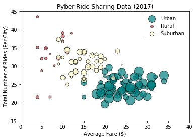
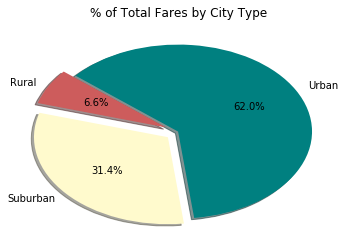
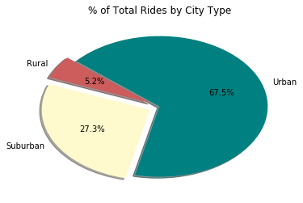
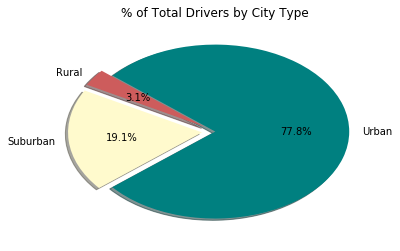

<b>Pyber Ride Sharing</b>

Analysis #1 About 2/3 of the evaluated Pyber transactions occurred in urban areas<br>
Analysis #2 Almost 1/3 of the Pyber revenue was collected in suburban areas<br>
Analylsis #3 Pyber activity by volume and revenue is greates in the urban areas evaluated


```python
import pandas as pd
import seaborn as sns
import matplotlib.pyplot as plt
import numpy as np
```


```python
city_csv = pd.read_csv('raw_data/city_data.csv')
ride_csv = pd.read_csv('raw_data/ride_data.csv')
```


```python
city_csv.head()
```


<div>
<style scoped>
    .dataframe tbody tr th:only-of-type {
        vertical-align: middle;
    }

    .dataframe tbody tr th {
        vertical-align: top;
    }

    .dataframe thead th {
        text-align: right;
    }
</style>
<table border="1" class="dataframe">
  <thead>
    <tr style="text-align: right;">
      <th></th>
      <th>city</th>
      <th>driver_count</th>
      <th>type</th>
    </tr>
  </thead>
  <tbody>
    <tr>
      <th>0</th>
      <td>Kelseyland</td>
      <td>63</td>
      <td>Urban</td>
    </tr>
    <tr>
      <th>1</th>
      <td>Nguyenbury</td>
      <td>8</td>
      <td>Urban</td>
    </tr>
    <tr>
      <th>2</th>
      <td>East Douglas</td>
      <td>12</td>
      <td>Urban</td>
    </tr>
    <tr>
      <th>3</th>
      <td>West Dawnfurt</td>
      <td>34</td>
      <td>Urban</td>
    </tr>
    <tr>
      <th>4</th>
      <td>Rodriguezburgh</td>
      <td>52</td>
      <td>Urban</td>
    </tr>
  </tbody>
</table>
</div>


```python
ride_csv.head()
```


<div>
<style scoped>
    .dataframe tbody tr th:only-of-type {
        vertical-align: middle;
    }

    .dataframe tbody tr th {
        vertical-align: top;
    }

    .dataframe thead th {
        text-align: right;
    }
</style>
<table border="1" class="dataframe">
  <thead>
    <tr style="text-align: right;">
      <th></th>
      <th>city</th>
      <th>date</th>
      <th>fare</th>
      <th>ride_id</th>
    </tr>
  </thead>
  <tbody>
    <tr>
      <th>0</th>
      <td>Sarabury</td>
      <td>2016-01-16 13:49:27</td>
      <td>38.35</td>
      <td>5403689035038</td>
    </tr>
    <tr>
      <th>1</th>
      <td>South Roy</td>
      <td>2016-01-02 18:42:34</td>
      <td>17.49</td>
      <td>4036272335942</td>
    </tr>
    <tr>
      <th>2</th>
      <td>Wiseborough</td>
      <td>2016-01-21 17:35:29</td>
      <td>44.18</td>
      <td>3645042422587</td>
    </tr>
    <tr>
      <th>3</th>
      <td>Spencertown</td>
      <td>2016-07-31 14:53:22</td>
      <td>6.87</td>
      <td>2242596575892</td>
    </tr>
    <tr>
      <th>4</th>
      <td>Nguyenbury</td>
      <td>2016-07-09 04:42:44</td>
      <td>6.28</td>
      <td>1543057793673</td>
    </tr>
  </tbody>
</table>
</div>


```python
combined_df = pd.merge(ride_csv, city_csv, on="city")
combined_df.head()
```


<div>
<style scoped>
    .dataframe tbody tr th:only-of-type {
        vertical-align: middle;
    }

    .dataframe tbody tr th {
        vertical-align: top;
    }

    .dataframe thead th {
        text-align: right;
    }
</style>
<table border="1" class="dataframe">
  <thead>
    <tr style="text-align: right;">
      <th></th>
      <th>city</th>
      <th>date</th>
      <th>fare</th>
      <th>ride_id</th>
      <th>driver_count</th>
      <th>type</th>
    </tr>
  </thead>
  <tbody>
    <tr>
      <th>0</th>
      <td>Sarabury</td>
      <td>2016-01-16 13:49:27</td>
      <td>38.35</td>
      <td>5403689035038</td>
      <td>46</td>
      <td>Urban</td>
    </tr>
    <tr>
      <th>1</th>
      <td>Sarabury</td>
      <td>2016-07-23 07:42:44</td>
      <td>21.76</td>
      <td>7546681945283</td>
      <td>46</td>
      <td>Urban</td>
    </tr>
    <tr>
      <th>2</th>
      <td>Sarabury</td>
      <td>2016-04-02 04:32:25</td>
      <td>38.03</td>
      <td>4932495851866</td>
      <td>46</td>
      <td>Urban</td>
    </tr>
    <tr>
      <th>3</th>
      <td>Sarabury</td>
      <td>2016-06-23 05:03:41</td>
      <td>26.82</td>
      <td>6711035373406</td>
      <td>46</td>
      <td>Urban</td>
    </tr>
    <tr>
      <th>4</th>
      <td>Sarabury</td>
      <td>2016-09-30 12:48:34</td>
      <td>30.30</td>
      <td>6388737278232</td>
      <td>46</td>
      <td>Urban</td>
    </tr>
  </tbody>
</table>
</div>


```python
cond_urban = combined_df.type == "Urban"
subset_urban = combined_df[cond_urban].dropna()

urban_df1 = subset_urban.pivot_table(index="city", values="fare", aggfunc=np.mean)
urban_df1 = urban_df1.reset_index()

urban_df2 = subset_urban.pivot_table(index="city", values="ride_id", aggfunc='count')
urban_df2 = urban_df2.reset_index()

urban_df = urban_df1.merge(urban_df2, on="city")
urban_df.columns = ['city', 'average_fare', 'number_of_rides']
urban_df = pd.merge(urban_df, city_csv, on="city")


cond_rural = combined_df.type == "Rural"
subset_rural = combined_df[cond_rural].dropna()

rural_df1 = subset_rural.pivot_table(index="city", values="fare", aggfunc=np.mean)
rural_df1 = rural_df1.reset_index()

rural_df2 = subset_rural.pivot_table(index="city", values="ride_id", aggfunc='count')
rural_df2 = rural_df2.reset_index()

rural_df = rural_df1.merge(rural_df2, on="city")
rural_df.columns = ['city', 'average_fare', 'number_of_rides']
rural_df = pd.merge(rural_df, city_csv, on="city")


cond_suburb = combined_df.type == "Suburban"
subset_suburb = combined_df[cond_suburb].dropna()

suburb_df1 = subset_suburb.pivot_table(index="city", values="fare", aggfunc=np.mean)
suburb_df1 = suburb_df1.reset_index()

suburb_df2 = subset_suburb.pivot_table(index="city", values="ride_id", aggfunc='count')
suburb_df2 = suburb_df2.reset_index()

suburb_df = suburb_df1.merge(suburb_df2, on="city")
suburb_df.columns = ['city', 'average_fare', 'number_of_rides']
suburb_df = pd.merge(suburb_df, city_csv, on="city")

```


```python
plt.scatter(urban_df['number_of_rides'], urban_df["average_fare"], label="Urban", alpha=0.7, marker="o", facecolors="teal", edgecolors="black", sizes=urban_df['driver_count']*5)
plt.scatter(rural_df['number_of_rides'], rural_df["average_fare"], label="Rural", alpha=0.7, marker="o", facecolors="indianred", edgecolors="black", sizes=rural_df['driver_count']*5)
plt.scatter(suburb_df['number_of_rides'], suburb_df["average_fare"], label="Suburban", alpha=0.7, marker="o", facecolors="lemonchiffon", edgecolors="black", sizes=suburb_df['driver_count']*5)

plt.xlim(0,40)
plt.ylim(15,45)
plt.title("Pyber Ride Sharing Data (2017)")
plt.legend(loc="best")
plt.ylabel("Total Number of Rides (Per City)")
plt.xlabel("Average Fare ($)")
plt.show()
```





```python
pie_df = pd.pivot_table(combined_df, values="fare", index="type", aggfunc=np.sum)
pie_df

plt.pie(pie_df, autopct="%1.1f%%", colors=['indianred','lemonchiffon','teal'], labels= ["Rural","Suburban","Urban"], explode=[0.1,0.1,0], shadow=True, startangle=140)
plt.title("% of Total Fares by City Type")
plt.show()
```





```python
pie_df2 = pd.pivot_table(combined_df, values="fare", index="type", aggfunc='count')
pie_df2

plt.pie(pie_df2, autopct="%1.1f%%", colors=['indianred','lemonchiffon','teal'], labels= ["Rural","Suburban","Urban"], explode=[0.1,0.1,0], shadow=True, startangle=140)
plt.title("% of Total Rides by City Type")
plt.show()
```





```python
pie_df3 = pd.pivot_table(city_csv, values="driver_count", index="type", aggfunc=np.sum)
pie_df3

plt.pie(pie_df3, autopct="%1.1f%%", colors=['indianred','lemonchiffon','teal'], labels= ["Rural","Suburban","Urban"], explode=[0.1,0.1,0], shadow=True, startangle=140)
plt.title("% of Total Drivers by City Type")
plt.show()
```




